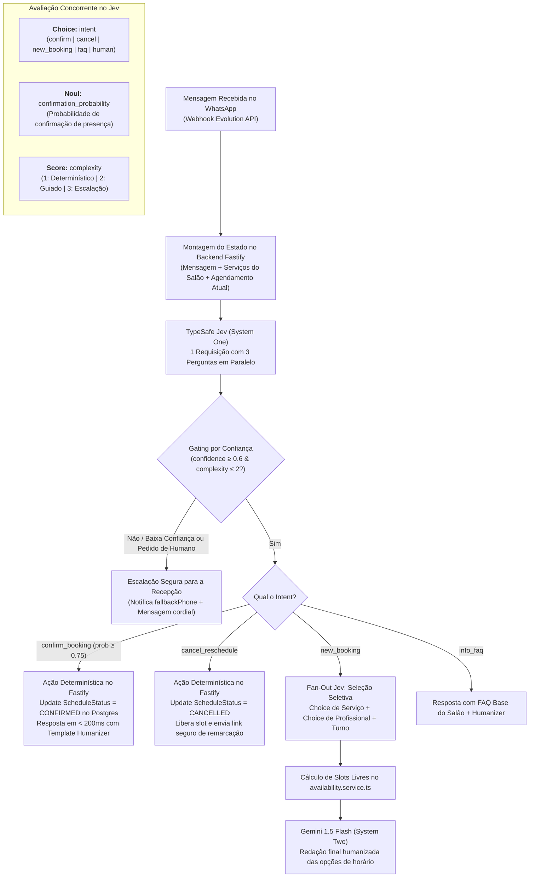
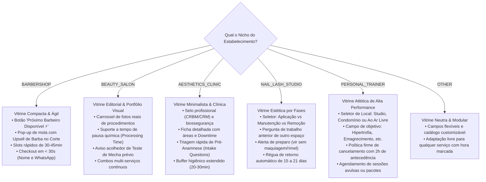
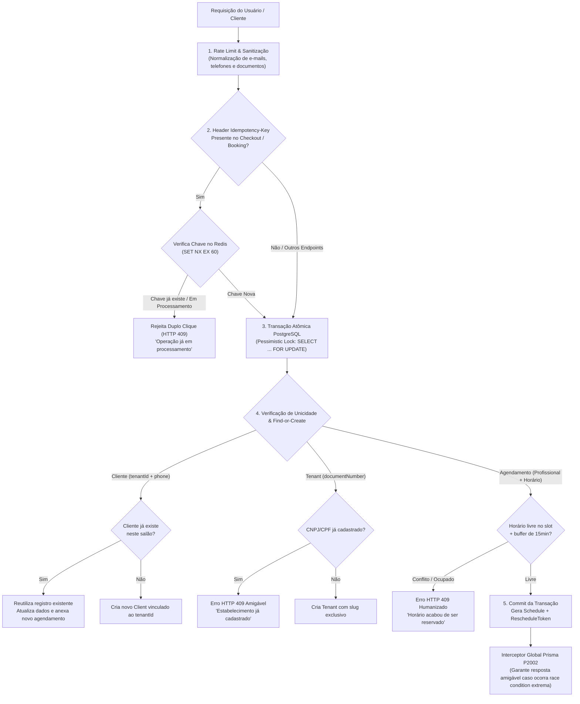

# Plano Mestre de Implementação — Marque Sua Hora

> **Para executores agentic:** SUB-SKILL OBRIGATÓRIA: Utilize `superpowers:subagent-driven-development` (recomendado) ou `superpowers:executing-plans` para implementar este plano tarefa por tarefa. As etapas usam a sintaxe de checkbox (`- [ ]`) para rastreamento.

**Produto:** **Marque Sua Hora** (`marquesuahora.com.br`)  
**Identidade Visual Oficial:**
- **Favicon & Ícones da Aplicação:** `brand/logo.jpg` (logo caligráfica cursiva roxa imperial `#7C3AED` com detalhes dourados em fundo branco puro `#FFFFFF`).
- **Páginas & Telas da Aplicação:** `brand/logo-semfundo.png` (PNG de alta resolução com fundo transparente para Landing Page, Navbar, Cabeçalho, Onboarding, Vitrine Pública `/[slug]`, Painel Administrativo `/dashboard` e Login).
- **Diretriz de Design:** Zero poluição visual; sem relógios ou ícones decorativos arbitrários.

**Objetivo:** Construir o **Marque Sua Hora**, um SaaS white-label de alto padrão para agendamento, gestão de equipe/comissões, financeiro, CRM com automação de WhatsApp nativa e Atendente Virtual com IA para barbearias de luxo, salões premium, clínicas de estética e personal VIP.

**Arquitetura:** Monorepo (`pnpm workspace`) contendo:
- `apps/web`: Next.js 14 (App Router) com Landing Page, Portal Público de Agendamento (`/[slug]`), Painel do Salão (`/dashboard`) e Painel Super Admin (`/admin`).
- `apps/api`: Node.js com Fastify v4+, TypeScript, Prisma ORM, BullMQ/Redis e integração Gemini Flash para a atendente virtual.
- `apps/mobile`: React Native com Expo, focado exclusivamente no uso prático do profissional na bancada.
- `packages/shared`: DTOs, regras de validação Zod e tipagens TypeScript compartilhadas.
- `infra/`: Docker Compose na VPS (`46.202.144.181`) com PostgreSQL 16, Redis 7 e Evolution API v2.

**Servidor VPS Homologado:**
- Host: `46.202.144.181` | SO: Ubuntu 24.04 LTS | Docker 29.1.3 + Docker Compose ativos.
- Acesso SSH sem senha configurado com chave pública Ed25519/RSA.

---

## Restrições Globais de Design, Qualidade & Linguagem

### 1. Regra de Ouro Impeccable (Anti-AI Slop & Sem Ícones Decorativos)
- Proibido usar ícones decorativos arbitrários em cards, títulos ou listas. Ícones são permitidos apenas quando exercem controle interativo direto (fechar modal, voltar tela, expandir sanfona, avançar página).
- A sofisticação visual depende de tipografia deliberada, contraste balanceado, espaçamento generoso (grid de 8pt) e resposta tátil precisa, sem poluição de enfeites visuais.

### 2. Padrão Humanizer de Redação (Linguagem Humana & Sem Vícios de IA)
Baseado integralmente na skill e padrões do [Humanizer](https://github.com/blader/humanizer) (derivado do projeto Wikipedia *Signs of AI writing*), todo o texto gerado na plataforma — incluindo a microcopy da interface web/mobile, mensagens de erro e sucesso, toasts, e-mails transacionais, templates de WhatsApp e o prompt system da Atendente Virtual IA — deve soar como uma pessoa real conversando, cortando sumariamente os vícios estruturais de IA.

Cada frase mantida deve adicionar uma informação concreta que o leitor ainda não possuía. O sistema adota as **25 Regras do Humanizer**, organizadas em 5 grupos:

#### Grupo A: Encenação em vez de Afirmação (Staging instead of stating)
1. **Sem contraste artificial ("Não X, mas Y"):**
   - *Regra:* Não use construções do tipo *"Não é apenas um agendamento, é uma transformação"*, *"Não é X, é Y"* ou a forma reversa *"X em vez de Y"*. Diga diretamente o que a funcionalidade faz.
   - *Errado:* "O Marque Sua Hora não é apenas um software de agenda; é o coração da sua barbearia."
   - *Certo:* "O Marque Sua Hora organiza seus horários e envia lembretes no WhatsApp para reduzir faltas."
2. **Sem encerramentos dramáticos ou chavões (One-line closers):**
   - *Regra:* Proibido usar sentenças curtas de efeito que apenas repetem ou dramatizam o parágrafo anterior (*"Esse é o verdadeiro ganho"*, *"Pense nisso"*, *"Divisor de águas"*, *"Simples assim"*).
   - *Errado:* "Os lembretes reduzem as faltas em 60%. Esse é o verdadeiro diferencial."
   - *Certo:* "Os lembretes automáticos reduzem as faltas em 60%."
3. **Sem provérbios com ar profundo (Sayings that sound deep):**
   - *Regra:* Elimine metáforas pretensiosas e aforismos vazios (*"no seu cerne"*, *"a verdadeira questão"*, *"fundamentalmente"*, *"a moeda de troca do setor"*, *"X se torna uma armadilha"*). Diga o ponto técnico de forma clara.
   - *Errado:* "No seu cerne, a pontualidade é a moeda de ouro da confiança no atendimento."
   - *Certo:* "Avisar o cliente com antecedência ajuda a manter a agenda do dia sem atrasos."
4. **Sem aberturas ensaiadas (Staged run-up):**
   - *Regra:* Remova preparações teatrais antes de dizer a mensagem (*"Vamos mergulhar em..."*, *"Aqui está o que você precisa saber"*, *"Para ser bem sincero"*, *"Olha só"*, *"Sem mais delongas"*).
   - *Errado:* "Vamos entender como funciona o cancelamento: aqui está o que você precisa saber."
   - *Certo:* "Você pode cancelar o horário com até 2 horas de antecedência."
5. **Sem discutir com ninguém (Arguing with no one):**
   - *Regra:* Não rebata objeções imaginárias que ninguém levantou (*"Isso não significa que você precise abrir mão do contato humano"*, *"Você pode achar tentador fazer na planilha, mas..."*). Apresente a funcionalidade sem ficar se justificando.

#### Grupo B: Ritmo Artificial por Regra (Rhythm by rule)
6. **Sem tríades forçadas (Forced triads):**
   - *Regra:* Modelos de IA agrupam ideias em três elementos para soar poético ou completo (*"rápido, prático e seguro"*, *"inovação, inspiração e resultados"*). Liste apenas os itens que realmente existem e importam.
   - *Errado:* "Uma experiência prática, ágil e transformadora para seu salão."
   - *Certo:* "O cliente escolhe o horário e recebe a confirmação pelo WhatsApp."
7. **Sem aberturas repetitivas de frase (Repeated sentence openings):**
   - *Regra:* Varie os sujeitos e a estrutura das frases. Evite abrir 3 frases seguidas com "O sistema...", "Você...", ou "O profissional...".
8. **Proibição de travessões como conectores universais (Dashes as connector):**
   - *Regra:* O texto final não deve conter travessões longos (em dash `—` ou en dash `–`) nem duplos hifens (` -- `) usados para emendar pensamentos. Use ponto final, vírgula, dois-pontos ou reescreva a oração. Deixe hifens normais apenas em palavras compostas da língua portuguesa ou URLs.
   - *Errado:* "O agendamento — enviado pelo WhatsApp — avisa o cliente sobre o horário."
   - *Certo:* "O agendamento, enviado pelo WhatsApp, avisa o cliente sobre o horário."
9. **Sem acúmulo de atenuadores (Stacked qualifiers):**
   - *Regra:* Elimine sequências de dúvida (*"pode potencialmente talvez ser possível considerar"*). Seja afirmativo: *"O sistema envia o lembrete"*.
10. **Sem pares hifenizados artificiais (Hyphenated pairs everywhere):**
    - *Regra:* Evite inventar compostos em inglês ou termos traduzidos desnecessariamente hifenizados.
11. **Voz ativa em vez de voz passiva sem sujeito (Active voice):**
    - *Regra:* Deixe claro quem realiza a ação. Em vez de *"O cancelamento foi realizado com sucesso"*, prefira *"Seu horário foi cancelado"* ou *"Cancelamos o seu agendamento"*.

#### Grupo C: Inflação & Falsa Autoridade (Inflation and borrowed authority)
12. **Lista Negra de Palavras Clichês de IA (Banned AI words):**
    - *Termos estritamente proibidos:* `crucial`, `robusto`, `mergulho profundo`, `ecossistema vibrante`, `tapeçaria`, `testemunho de`, `fundamental`, `intrincado`, `aprimorar`, `lapidar`, `fomentar`, `destacar`, `alinhar`, `revolucionário`, `divisor de águas`, `orquestrar`, `holístico`, `sinergia`.
13. **Sem significância inflada (Inflated significance):**
    - *Regra:* Não trate tarefas rotineiras de atendimento como marcos históricos (*"marca um momento crucial na evolução do seu negócio"*, *"o futuro parece brilhante"*, *"um passo na direção certa"*). Diga o benefício prático imediato.
14. **Sem conexões vagas (Vague connection):**
    - *Regra:* Em vez de dizer que um recurso está *"associado à comodidade"*, diga exatamente o que ele executa.
15. **Sem gerúndios acessórios superficiais (Shallow -ing riders):**
    - *Regra:* Evite caudas de gerúndio coladas ao fim da frase (*"..., garantindo uma experiência ímpar"*, *"..., simbolizando a união de tecnologia e afeto"*).
16. **Sem linguagem de vendas vazia (Sales language):**
    - *Regra:* Proibido usar adjetivos vazios como *"ostenta"*, *"vibrante"*, *"rico"*, *"de tirar o fôlego"*, *"imperdível"*, *"incomparável"*. Descreva os fatos: duração, procedimento e preço.
17. **Sem falsa autoridade de terceiros (Borrowed authority):**
    - *Regra:* Não use *"especialistas afirmam"*, *"estudos comprovam"*, *"fontes da indústria apontam"*, a menos que haja um dado numérico exato com fonte citada.
18. **Substituição de floreios por 'é' e 'tem' (Avoiding is/are/has):**
    - *Regra:* Não use *"atua como"*, *"serve como"*, *"opera como"*, *"apresenta-se como"*. Use simplesmente *"é"* ou *"tem"*.

#### Grupo D: Formatação Mecânica (Formatting by rule)
19. **Sem negrito como decoração (Bold as decoration):**
    - *Regra:* Não aplique negrito aleatoriamente em todas as frases, e não monte listas verticais em que cada linha começa com um rótulo em negrito seguido de dois-pontos quando o texto corrido for mais claro.
20. **Títulos diretos sem emojis decorativos (Decorative headings):**
    - *Regra:* Títulos de seções e telas usam caixa-baixa natural (Sentence case), sem Title Case mecânico em todas as palavras e **sem emojis decorativos** (proibido 🚀, 💡, ✨, 🔥, 📅 no início de títulos).
21. **Aspas retas padronizadas (Straight quotes):**
    - *Regra:* Use aspas retas normais (`"` e `'`) em vez de aspas tipográficas curvas inconsistentes (`“` e `”`).

#### Grupo E: Resíduos de Chatbot & Rascunho (Leftovers from chat and draft)
22. **Proibição absoluta de resíduos de chatbot (Chatbot residue):**
    - *Regra:* A Atendente IA no WhatsApp e as notificações nunca devem usar frases prontas de assistente virtual robótico:
      - Banido: *"Certamente!"*, *"Com certeza!"*, *"Ótima pergunta!"*, *"Espero que ajude!"*, *"Fico à disposição para esclarecer qualquer dúvida!"*, *"Posso ajudar em algo mais?"*, *"Como modelo de linguagem..."*.
    - *Tom exigido:* O tom de uma recepcionista atenciosa, educada e ágil de um salão de alto padrão: cumprimenta pelo nome, responde a pergunta com objetividade e pergunta educadamente se o cliente deseja confirmar ou escolher outro horário.
23. **Sem disclaimers de limite de conhecimento ou palpites:**
    - *Regra:* A Atendente IA nunca inventa serviços que o salão não cadastrou nem dá desculpas de IA (*"como uma IA, não sei..."*). Se a dúvida for sobre algo fora do cadastro (ex: estacionamento com manobrista), direciona educadamente para o telefone de contato da recepção.
24. **Sem repetição de título na primeira frase:**
    - *Regra:* Em telas de ajuda, onboarding e e-mails, não repita o título da página logo no primeiro parágrafo.
25. **Sem falar da versão anterior:**
    - *Regra:* Documentação, mensagens e microcopy explicam o que o software faz hoje, sem ficar mencionando versões anteriores ou métodos manuais ultrapassados.

---

#### Exemplos de Aplicação Prática no Marque Sua Hora

##### A. Lembrete de WhatsApp 24h & 12h
- ❌ **Com vícios de IA:**
  > *"Olá, prezado(a) João! Esperamos que você esteja tendo um dia incrível! Passando para destacar que o seu horário crucial de Corte Masculino está marcado para amanhã, às 15:00, com o profissional Carlos — uma experiência personalizada e única. Por favor, responda com SIM para confirmar. Esperamos que ajude! Tenha um ótimo dia!"*
- ✅ **Com padrão Humanizer:**
  > *"Oi, João! Tudo bem? Passando para lembrar do seu corte amanhã às 15h com o Carlos no Studio Elegance. Consegue me confirmar se você vem com um joinha ou me avisa se precisar remarcar?"*

##### B. Atendente Virtual IA no WhatsApp (Plano VIP)
- ❌ **Com vícios de IA:**
  > *"Com certeza! Fico muito feliz em ajudar com sua solicitação de agendamento hoje. Temos uma vasta gama de opções para você mergulhar em nosso menu de serviços de luxo. Gostaria de verificar os horários disponíveis com o barbeiro Carlos na parte da tarde? Aguardo sua resposta!"*
- ✅ **Com padrão Humanizer:**
  > *"Oi, Maria! Temos sim. O Carlos tem horário livre hoje às 14h30 e às 17h para corte e hidratação. Algum desses fica bom para você?"*

##### C. Microcopy de Erro / Toast na Interface Web
- ❌ **Com vícios de IA:**
  > *"Ops! Algo inesperado aconteceu em nosso ecossistema robusto. Não se preocupe, estamos trabalhando arduamente para aprimorar sua experiência. Tente novamente mais tarde."*
- ✅ **Com padrão Humanizer:**
  > *"Não conseguimos carregar os horários agora. Verifique sua conexão e tente de novo em alguns instantes."*

##### D. Modal de Confirmação (`ConfirmModal`)
- ❌ **Com vícios de IA:**
  > *"Atenção! Esta ação representa um marco irreversível em sua conta. Tem certeza absoluta de que deseja proceder com a exclusão do profissional? Pense com cuidado antes de continuar."*
- ✅ **Com padrão Humanizer:**
  > *"Excluir o profissional Carlos da equipe? Os agendamentos futuros dele precisarão ser transferidos para outro colaborador. Essa ação não pode ser desfeita."*

### 3. Proibição de Diálogos Nativos do Navegador (Zero `window.confirm` / `alert`)
- Proibido o uso de `window.confirm()`, `window.alert()` ou `window.prompt()`.
- Toda confirmação de exclusão ou ação irreversível deve usar exclusivamente o componente **`ConfirmModal` / `DestructiveDialog`** (Radix UI Dialog + Framer Motion) com fundo escurecido com desfoque (`backdrop-blur-sm bg-black/40`), foco acessível por teclado, tecla ESC para fechar e botão de confirmação em vermelho escuro com indicador de carregamento.

### 4. Design Tokens & Paleta
- Primária Roxo Profundo: `#7C3AED` (hover: `#6D28D9`, active: `#5B21B6`)
- Secundária Suave: `#EDE9FE` (fundo cards/destaques suaves: `#F5F3FF`)
- Accent Gold: `#D4AF37` (badges VIP, detalhes de prestígio, indicadores de status premium)
- Accent Teal: `#0D9488` (ações secundárias refinadas, botões de ação auxiliar)
- Fundo Claro: `#FFFFFF` / `#FAFAF9` (branco puro / branco gelo, limpo e sofisticado)
- Fundo Dark Mode: `#0F172A` (slate dark, cards em `#1E293B`)
- Texto Principal: `#111827` (alto contraste, nunca preto puro 100%)
- Texto Secundário: `#6B7280` (legível e discreto)
- Status: Sucesso Forest `#059669`, Alerta Amber `#D97706`, Cancelado Burgundy `#DC2626`

### 5. Tipografia
- Logo Oficial: Caligráfica cursiva refinada (vide `brand/logo.jpg`)
- Display / Títulos de Interface: `Poppins` (SemiBold 600-700, letter-spacing -0.5px)
- Subtítulos e detalhes refinados: `Lora` (Regular italic)
- Corpo de texto, formulários e tabelas: `Inter` (Regular 400 / Medium 500)
- Horários, Moedas e Datas: `JetBrains Mono` (Medium 500)

### 6. UI/UX Pro Max
- Todos os componentes interativos possuem 6 estados mapeados: `Default`, `Hover`, `Focus-visible`, `Active`, `Disabled`, `Loading (Skeleton)`.
- Área de toque mínima em mobile de 44x44px.
- Layout 100% responsivo a partir de 375px (mobile) até 1440px+ (desktop ultrawide).

### 7. Motor de Tomada de Decisões com IA: TypeSafe Jev (System One Decision Core)

Para eliminar gargalos de latência, custos exorbitantes de tokens e o risco inaceitável de alucinações de modelos generativos em regras de negócio, o **Marque Sua Hora** adota o **Jev** — modelo carro-chefe de **System One** da [TypeSafe](https://docs.typesafe.ai) — como o motor central de decisões do backend.

#### Filosofia: Código Comanda o Fluxo, Jev Fornece o Senso Comum
- **Modelos Generativos Tradicionais (System Two - Gemini/GPT):** Foram concebidos para redigir textos longos. Quando forçados a atuar como roteadores de código, são lentos (1 a 4 segundos), caros e imprevisíveis.
- **Modelos System One (Jev):** Retornam decisões rápidas (< 100ms), calibradas e tipadas (`Choice`, `Noul` e `Score`) a partir do estado do sistema e linguagem natural. O Jev não gera texto livre; ele julga condições e seleciona opções. O código Fastify executa as ações no banco e nos serviços de forma 100% determinística.



#### Primitivas Utilizadas no Marque Sua Hora

1. **`choice` — Classificação e Seleção Estrita:**
   - **Roteamento de Intenção do WhatsApp:**
     ```ts
     const intentQuestion = choice("Qual a intenção primária desta mensagem?", {
       confirm_booking: "O cliente está confirmando presença em um horário já marcado",
       cancel_reschedule: "O cliente quer cancelar ou remarcar o horário",
       new_booking: "O cliente quer marcar um novo horário ou saber vagas disponíveis",
       info_faq: "Dúvidas de preço, endereço, localização, estacionamento ou pagamento",
       talk_to_human: "O cliente pede explicitamente para falar com uma pessoa da recepção",
       other: "Outro assunto irrelevante ou conversa genérica",
     });
     ```
   - **Seleção de Serviço e Profissional (Select instead of generate):**
     O Jev recebe a lista de serviços do salão (`{ [id]: "Corte Masculino", [id2]: "Barba" }`) e seleciona diretamente o ID correto, evitando alucinações de serviços inexistentes.

2. **`noul` — Probabilidade Calibrada de Condição Sim/Não:**
   - **Confirmação Expressa de Lembrete:**
     ```ts
     const confirmQuestion = noul(
       "O cliente está afirmando de maneira clara que vai comparecer ao compromisso?"
     );
     ```
     Se `answers.confirmQuestion.probability >= 0.75`, o status do agendamento é alterado para `CONFIRMED` na hora sem necessidade de chamar LLMs generativos.
   - **Guardrail de Conformidade com o Humanizer:**
     ```ts
     const slopQuestion = noul(
       "Este texto contém clichês de IA, frases engessadas de assistente virtual (como 'Certamente!', 'Com certeza!', 'Espero que ajude!') ou tom corporativo artificial?"
     );
     ```
     Se `probability > 0.40`, a mensagem gerada é sumariamente descartada pelo backend e substituída pelo template canônico seguro.

3. **`score` — Complexidade Gradual & Risco de No-Show:**
   - **Complexidade do Atendimento:**
     ```ts
     const complexityQuestion = score(
       "Qual o nível de complexidade desta solicitação para automação segura?",
       [
         "Procedimento padrão direto (ex: sim/não, confirmar, cancelar)",
         "Conversação guiada de agendamento dentro do catálogo de serviços",
         "Reclamação, situação atípica, negociação ou pedido fora do padrão",
       ]
     );
     ```
     Se `score === 3` ou `confidence < 0.5`, o sistema executa a escalação para um atendente humano imediatamente.
   - **Score de Risco de Falta (CRM):**
     O Jev analisa justificativas de desmarcações anteriores do cliente para atribuir um índice de pontualidade no perfil do cliente no CRM.

#### Status de Homologação & Chave no Ambiente
- **Ambiente Local:** Variável `TYPESAFE_API_KEY` configurada e validada globalmente no sistema operacional.
- **Teste de Conectividade em Tempo Real:** Executado com sucesso contra o endpoint `https://api.typesafe.ai/v1/systemone` utilizando `jev-latest` (respondendo como `jev-1.13.0`), com inferência em frações de segundo e acurácia de 99% na classificação de intenção de agendamento (`new_booking`).
- **Prontidão de Produção:** A chave será propagada no `.env` do backend Fastify em `apps/api` e no serviço de Docker Compose na VPS (`46.202.144.181`).

---

## Estratégia de Monetização & Gestão Dinâmica de Planos pelo Admin

O modelo comercial do **Marque Sua Hora** é totalmente flexível e gerenciado com autonomia pelo **Super Admin** através do painel `/admin/planos`. **Nenhum valor, limite ou recurso possui padrão (default) rígido fixado no código**: o administrador define livremente as mensalidades, as franquias de agendamentos, o valor cobrado por agendamento extra, o número de profissionais permitidos e os módulos liberados em cada plano.

A tabela a seguir apresenta os planos de referência sugeridos para a plataforma, que podem ser criados, renomeados, precificados e ajustados dinamicamente pelo Super Admin a qualquer momento:

| Plano | Preço | Limite de Profissionais | Limite de Agendamentos | WhatsApp & Lembretes | Diferenciais & Features Exclusivas |
| :--- | :--- | :--- | :--- | :--- | :--- |
| **Gratuito (Híbrido)** | **R$ 0,00** | 1 Profissional | 20 agendamentos / mês | Lembretes automáticos 24h e 12h | **Modo Pós-Pago:** R$ 0,79 por agendamento extra após os 20 gratuitos. Não bloqueia a agenda. Sem necessidade de cartão no cadastro. |
| **Solo** | **R$ 29,90** /mês | 1 Profissional | **Ilimitados** | Lembretes automáticos 24h e 12h | Ideal para autônomos. Link público customizável (`/seu-salao`), gestão financeira de entradas/saídas e histórico completo de clientes. |
| **Equipe Pro** | **R$ 49,90** /mês | Até 5 Profissionais | **Ilimitados** | Lembretes automáticos 24h e 12h | Logins individuais para os profissionais, cálculo automático de comissões por colaborador, Ficha de Anamnese Digital com fotos antes/depois, sincronização Google Calendar e exportação PDF/CSV. |
| **VIP + Atendente IA** | **R$ 79,90** /mês | **Ilimitados** | **Ilimitados** | **Atendente Virtual 24/7 com IA** | **Atendente IA no WhatsApp do Salão:** responde clientes com linguagem humana e natural, tira dúvidas sobre serviços, consulta horários livres em tempo real e agenda direto pelo chat. White-label total e suporte prioritário. Cobrança do SaaS integrada via Asaas. |

---

## Mapeamento Completo dos 13 CRUDs do Sistema

Cada CRUD possui validação estrita via Zod, permissões por Role (Super Admin, Admin do Salão, Profissional, Recepção) e confirmação de exclusão via `ConfirmModal`:

1. **CRUD Tenants (Salões / Negócios & Onboarding Inteligente):**
   - **Campos:** `id`, `businessName`, `slug`, `niche` (`BARBERSHOP`, `BEAUTY_SALON`, `AESTHETICS_CLINIC`, `PERSONAL_TRAINER`, `NAIL_LASH_STUDIO`, `OTHER`), `documentType` (`CNPJ`, `CPF`), `documentNumber`, `legalName`, `phone` (WhatsApp comercial / recepção), `description` (bio da vitrine), `instagramUrl`, `postalCode`, `street`, `number`, `complement`, `neighborhood`, `city`, `state`, `isSingleCityZip`, `terminology` (JSONB com rótulos adaptados ao nicho), `logoUrl`, `themeTemplate`, `primaryColor`, `secondaryColor`, `accentColor`, `minNoticeMinutes`, `bufferMinutes`, `maxAdvanceBookingDays`, `birthdayMessageEnabled`, `birthdayMessageCustom`, `showcaseConfig`, `intakeQuestions`, `googleReviewUrl`, `npsFeedbackEnabled`, `depositRequired`, `depositType`, `depositAmount`, `maxNoShowsAllowed`, `churnRecoveryEnabled`, `churnAlertDays`, `asaasCustomerId`, `asaasSubscriptionId`, `billingStatus`, `extraBookingsBalance`, `blockedReason`, `blockedAt`, `createdAt`.
   - **Operações:** Cadastro guiado no Onboarding em 5 passos com mutação dinâmica de interface por nicho, preenchimento instantâneo de dados cadastrais, endereço inteligente via CEP, catálogo de serviços sugeridos e identidade visual com templates de tema (C), Consulta pública da vitrine e configurações (R), Edição de marca/regras/nicho/contato (U), Soft-delete com cancelamento de assinaturas (D).
   - **Exclusão:** `ConfirmModal` exigindo digitação do nome do salão para confirmação.

2. **CRUD Profissionais & Escalas de Trabalho:**
   - **Campos:** `id`, `tenantId`, `userId`, `name`, `specialty`, `commissionPercent`, `workingHours` (JSONB com horários e folgas semanais), `vacationPeriods` (JSONB).
   - **Operações:** Cadastro com vínculo a usuário (C), Listagem de equipe e disponibilidade (R), Ajuste de comissão e horários (U), Inativação/Exclusão com remanejamento de clientes (D).
   - **Exclusão:** `ConfirmModal` alertando sobre agendamentos futuros pendentes.

3. **CRUD Serviços, Combos & Pacotes:**
   - **Campos:** `id`, `tenantId`, `resourceId`, `name`, `description`, `durationMinutes`, `price`, `category`, `allowOnlineBooking`, `serviceType` (`STANDARD`, `APPLICATION`, `MAINTENANCE`, `REMOVAL`, `EVALUATION`), `intakeWarning`, `processingMinutes`, `finishingMinutes`, `photos` (galeria de resultados reais), `requiresRemovalCheck`.
   - **Operações:** Cadastro individual ou combo com dados de nicho (C), Exibição na vitrine pública e interna (R), Ajuste de preços, tempos de pausa e fotos (U), Inativação segura (D).

4. **CRUD Motor de Agendamentos (Schedules):**
   - **Campos:** `id`, `tenantId`, `clientId`, `professionalId`, `serviceId`, `resourceId`, `additionalServices` (JSONB com múltiplos serviços selecionados), `totalDurationMinutes`, `totalPrice`, `date`, `startTime`, `endTime`, `status` (`PENDING`, `CONFIRMED`, `IN_SERVICE`, `COMPLETED`, `NO_SHOW`, `CANCELLED`), `rescheduleToken`, `notes`, `source` (`ONLINE`, `PRESENTIAL`, `AI_WHATSAPP`), `intakeAnswers`, `serviceLocation`, `travelBufferMinutes`, `packageRemainingSessions`, `isMaintenance`, `depositAmount`, `depositPaid`, `depositPixCode`, `depositExpiresAt`, `npsScore`, `npsFeedback`.
   - **Operações:** Marcação atômica com trava no Postgres e sinal PIX (C), Grade multi-coluna por profissional na visão diária/semanal (R), Reagendamento via Drag & Drop ou link com token seguro (U), Cancelamento com liberação de slot e aviso no WhatsApp (D).

5. **CRUD Bloqueios de Agenda (Schedule Blocks / Pausas):**
   - **Campos:** `id`, `tenantId`, `professionalId` (opcional; nulo = bloqueio geral do salão), `date`, `startTime`, `endTime`, `reason` (Almoço, Médico, Folga Extra, Manutenção).
   - **Operações:** Criação rápida com 1 clique na agenda (C), Listagem sobreposta na grade visual (R), Edição de horários (U), Liberação imediata do horário (D).

6. **CRUD Clientes, CRM & Aniversariantes:**
   - **Campos:** `id`, `tenantId`, `name`, `phone`, `email`, `birthday` (Date), `notifyBirthday` (Boolean), `lastBirthdayGreetingYear` (Int), `tags` (`VIP`, `Recorrente`, `NoShowFreq`, `Aniversariante`), `packageBalance`, `noShowCount`, `avgVisitDays`, `lastVisitAt`, `lastChurnAlertSentAt`, `isBlockedOnline`.
   - **Operações:** Cadastro automático ou manual com padrão find-or-create por telefone (C), Busca instantânea com filtros de Aniversariantes, Clientes em Risco e Faltas (R), Atualização de tags, datas e desbloqueio (U), Exclusão LGPD (D).
   - **Automações Integradas:** Disparo matinal às 09:00 de parabéns cordial (sem presentes) e reativação semanal de sumidos.

7. **CRUD Ficha de Anamnese Digital:**
   - **Campos:** `id`, `tenantId`, `clientId`, `formSchema` (JSONB com campos dinâmicos: alergias, sensibilidade, histórico médico), `answers` (JSONB), `photos` (URLs de fotos antes/depois com anotações).
   - **Operações:** Criação e preenchimento (C), Histórico visual comparativo (R), Atualização periódica da ficha (U), Exclusão de registros fotográficos via `ConfirmModal` (D).

8. **CRUD Financeiro, Despesas & Comissões:**
   - **Campos:** `id`, `tenantId`, `scheduleId`, `professionalId`, `type` (`INCOME`, `EXPENSE`), `amount`, `category`, `paymentMethod` (`PIX`, `CASH`, `CARD`), `description`, `date`.
   - **Operações:** Lançamento de pagamento e despesa com abatimento de sinal PIX (C), DRE resumido, extrato e comissões por colaborador (R), Edição de lançamentos (U), Estorno com rastreabilidade (D).

9. **CRUD Planos & Tarifas (Exclusivo Super Admin - Zero Defaults no Banco):**
   - **Campos:** `id`, `code` (identificador único customizado), `name`, `description`, `monthlyPrice` (Decimal), `maxProfessionals` (Int), `isUnlimitedBookings` (Boolean), `monthlyFreeBookings` (Int), `extraBookingFee` (Decimal), `hasAiAssistant` (Boolean), `hasAnamnesis` (Boolean), `hasCommissions` (Boolean), `hasGoogleCalendar` (Boolean), `features` (JSONB com lista de benefícios exibidos nos cards), `active` (Boolean).
   - **Operações:** Super Admin cria novos planos personalizados com qualquer preço e regra sem valores default (`POST /api/v1/admin/plans`), edita parâmetros e taxas de planos existentes (`PUT /api/v1/admin/plans/:id`), ativa/desativa planos para novas contratações (`PATCH /api/v1/admin/plans/:id/toggle-active`); Salão consulta planos ativos (`GET /api/v1/plans`), escolhe o plano no onboarding ou realiza upgrade/downgrade com sincronização no gateway Asaas.

10. **CRUD Integração WhatsApp & Atendente IA:**
    - **Campos:** `id`, `tenantId`, `instanceName`, `connected`, `promptSystemAi`, `autoBookingEnabled`, `fallbackNumber`, `templates` (JSONB).
    - **Operações:** Gerar QR Code de conexão (C), Monitorar status e histórico de conversas (R), Customizar instruções humanizadas da IA e mensagens (U), Desconectar instância (D).

11. **CRUD Recursos Físicos Compartilhados (Resource - Salas, Cabines, Equipamentos & Lavatórios):**
    - **Campos:** `id`, `tenantId`, `name`, `type` (`ROOM`, `EQUIPMENT`, `CHAIR`), `isActive`.
    - **Operações:** Cadastro de salas clínicas, aparelhos de laser ou lavatórios vinculados a serviços (C), Listagem de ocupação e visão de grade por recurso (R), Edição de nomes e tipos (U), Inativação segura (D).

12. **CRUD Suporte via Tickets por Loja (SupportTicket, TicketMessage, TicketTask):**
    - **Campos:** `id`, `protocol` (`#TK-YYYY-XXXX`), `tenantId`, `userId`, `subject`, `category`, `priority`, `status`, `messages` (com anexos de imagem e áudio `MediaRecorder`), `tasks` (checklist dinâmica de resolução com barra de progresso).
    - **Operações:** Abertura de chamado pelo salão com protocolo automático (C), Visualização da thread estilo chat com player de voz e visualizador de prints (R), Envio de respostas, adição de notas privadas internas e marcação de checklist (U), Fechamento do chamado (D).

13. **Trilha de Auditoria do Sistema (AuditLog - Exclusivo Super Admin):**
    - **Campos:** `id`, `tenantId`, `userId`, `action` (`IMPERSONATE_START`, `TENANT_BLOCK_MANUAL`, `PLAN_CREATE`, `PLAN_UPDATE`), `entityType`, `entityId`, `details` (JSONB), `ipAddress`, `userAgent`, `createdAt`.
    - **Operações:** Registro imutável de eventos sensíveis pelo backend (C), Consulta paginada com filtros por operador, ação e data no painel `/admin` (R).

---

## Recursos Críticos da Agenda & Prevenção de Falhas Operacionais

Para que o salão opere sem atritos, filas, atrasos ou prejuízos com cadeiras vazias, o motor de agendamento incorpora 8 mecanismos fundamentais de proteção e agilidade:

### 1. Prevenção Concorrente de Overbooking (Atomic Database Locks)
- **Problema real:** Dois clientes tentam marcar o mesmo horário de 15:00 simultaneamente (ex: um navegando no link público e outro interagindo com a Atendente IA no WhatsApp).
- **Solução no Marque Sua Hora:** O endpoint de reserva executa uma transação no PostgreSQL com lock de concorrência (`SELECT ... FOR UPDATE` nos slots do profissional e data). A primeira requisição confirma a reserva no milissegundo; a segunda detecta o conflito antes de salvar e retorna imediatamente: *"Este horário acabou de ser preenchido. Selecione um dos próximos horários livres: 15h45 ou 16h30."*

### 2. Intervalo Automático de Higienização e Preparo (`bufferMinutes`)
- **Problema real:** Agendamentos colados fazem com que o atraso de 10 minutos em um cliente gere um efeito dominó de atrasos para o resto do dia.
- **Solução:** Todo serviço possui intervalo de respiro automático (padrão de 15 minutos, configurável por salão ou por serviço). Se um corte dura 45 minutos (14:00 às 14:45), o próximo horário só é liberado a partir das 15:00. O profissional tem tempo para esterilizar tesouras/máquinas, limpar a bancada e receber o próximo cliente com pontualidade impecável.

### 3. Agendamento Multi-Serviço (Combos em Bloco Contínuo)
- **Problema real:** O cliente deseja cortar o cabelo (30min) e fazer a barba (30min). Apps amadores forçam dois agendamentos separados, que muitas vezes caem em dias ou profissionais diferentes.
- **Solução:** O motor calcula a soma das durações dos serviços selecionados (`totalDurationMinutes`) e reserva um **bloco contínuo único** na grade do profissional escolhido, aplicando o buffer apenas ao final do bloco completo.

### 4. Visão Multi-Profissional em Colunas (Bancada em Tempo Real)
- **Painel Recepção & Dono:** Grade do dia organizada em colunas verticais (uma coluna para cada profissional lado a lado) com marcadores visuais de status:
  - 🟡 **Pendente:** Aguardando confirmação do cliente.
  - 🔵 **Confirmado:** Cliente confirmou presença via WhatsApp ou link.
  - 🟢 **Em Atendimento:** Cliente sentado na cadeira realizando o procedimento.
  - ⚪ **Concluído:** Atendimento finalizado e comanda enviada ao caixa.
  - 🔴 **Falta (No-Show):** Cliente não compareceu.
  - ⚫ **Bloqueio:** Horário indisponível (almoço, médico ou pausa).

### 5. Arrastar e Soltar com Validação Instantânea (Drag & Drop)
- A recepção pode arrastar um agendamento para outro horário ou para outro profissional compatível.
- O sistema valida instantaneamente se o novo horário está livre e respeita a escala de trabalho, recalculando automaticamente as comissões e disparando aviso no WhatsApp do cliente com as novas informações.

### 6. Bloqueio Rápido de Horário (Pausa / Intervalo com 1-Toque)
- Botão instantâneo na agenda para criar um `ScheduleBlock` (ex: "Pausa Almoço", "Consulta Médica", "Manutenção de Bancada") sem necessidade de cadastrar um cliente fictício.

### 7. Gestão de Tolerância a Atrasos e Detecção de No-Show
- Se o cliente não chegar após **15 minutos** do início marcado, o card na agenda ganha uma borda âmbar pulsante e ativa dois botões de ação imediata:
  - Botão WhatsApp: *"Oi [Nome], tudo bem? Estamos te aguardando no salão para seu horário das 14h. Consegue nos avisar se está a caminho?"*
  - Botão Marcar Falta: libera a cadeira imediatamente para encaixes presenciais e incrementa o contador `noShowCount` do cliente.

### 8. Gestão & Automação Completa de Aniversariantes (Somente Mensagem Cordial)
- **Relacionamento Genuíno no Dia Especial:**
  - O sistema foca no acolhimento humano e consideração pelo cliente, **sem ofertas comerciais, sem cupons de desconto e sem presentes/brindes** — enviando estritamente uma mensagem calorosa e sincera de felicitações.
- **Disparo Automático no WhatsApp (BullMQ Cron diário às 09:00):**
  - O sistema localiza todos os clientes do salão que fazem aniversário no dia (`Client.birthday`) e envia uma mensagem carinhosa e natural, auditada pelas regras do Humanizer (sem clichês de chatbot):
    > *"Oi, [Nome]! Passando para te desejar um feliz aniversário! Toda a equipe do [Nome do Salão] deseja muitas felicidades, saúde e um dia excelente para você. Um abraço carinhoso de todos nós!"*
- **Aviso na Agenda:**
  - Se um cliente agendado fizer aniversário no dia ou na semana do atendimento, seu card na agenda exibe uma badge sutil `🎂 Aniversariante`, permitindo que o profissional e a recepção parabenizem o cliente pessoalmente no salão.
- **Filtro no CRM:**
  - Abas rápidas no CRM (`/dashboard/clientes`) para visualizar "Aniversariantes do Mês" e "Aniversariantes da Semana", com atalho de 1-clique para parabenizar via WhatsApp.

### 9. Sinal Opcional Anti-No-Show via PIX Dinâmico (Reserva Garantida)
- **Objetivo:** Eliminar o prejuízo de cadeiras vazias nas sextas, sábados ou horários nobres de alta demanda.
- **Configuração no Salão (`Tenant`):**
  - Toggle `depositRequired: Boolean` (ativável pelo estabelecimento).
  - Tipo de sinal: `depositType` (`FIXED` ex: R$ 20,00 ou `PERCENTAGE` ex: 30% do total do serviço).
- **Mecânica do Fluxo de Agendamento:**
  - Ao escolher o horário na vitrine `/[slug]`, o sistema reserva o slot temporariamente (trava de 15 minutos no Redis) e gera o QR Code e código PIX Copia e Cola instantâneo via Asaas/Gateway.
  - Se o cliente efetuar o pagamento dentro dos 15 minutos: o webhook da API liquida o sinal (`depositPaid = true`), move o status para `CONFIRMED` e dispara a confirmação no WhatsApp com o valor restante a pagar no salão.
  - Se o tempo expirar sem pagamento: o Redis expira a chave e o horário volta a ficar livre automaticamente na agenda para outros clientes.
- **Abatimento no Balcão:** O valor do sinal pago é abatido automaticamente da comanda no fechamento do caixa (`FinancialEntry`).

### 10. Preenchimento Automático de Vaga por Desistência (Smart Waitlist Auto-Fill)
- **Objetivo:** Garantir 100% de ocupação na grade e reverter cancelamentos de última hora em faturamento imediato.
- **Mecânica Automatizada (BullMQ `waitlist-queue`):**
  - No exato momento em que um agendamento é cancelado ou remarcado (via link do cliente ou pelo dashboard), o worker consulta a tabela `WaitlistEntry` para a mesma data, turno e preferência de profissional/serviço.
  - O sistema localiza o primeiro cliente da fila e dispara um WhatsApp prioritário com template Humanizer:
    > *"Oi, [Nome]! Acabou de liberar um horário para hoje às [Horário] com [Profissional] no [Nome do Salão]. Como você estava na nossa lista de espera, a preferência é sua! Quer garantir essa vaga? Responda SIM em até 10 minutos."*
  - **Janela de Resposta de 10 Minutos:**
    - Se o cliente responder "SIM" (processado pelo Jev em < 100ms): a vaga é convertida automaticamente (`status: CONVERTED`), o agendamento é criado como `CONFIRMED` e o cliente recebe a confirmação.
    - Se não responder em 10 minutos: o status muda para `EXPIRED` e o sistema oferece a vaga para o próximo cliente da fila.

### 11. Recuperação Automática de Clientes Sumidos (Reativação de Churn)
- **Objetivo:** Recuperar clientes recorrentes que estão há muito tempo sem agendar, aumentando a retenção sem custos de marketing.
- **Mecânica do Worker BullMQ (`churn-queue`):**
  - Cron executado semanalmente (às segundas-feiras, 10:00).
  - O algoritmo calcula o intervalo médio histórico entre visitas de cada cliente (`Client.avgVisitDays`, ex: corta cabelo a cada 18 dias; mechas a cada 60 dias).
  - Se o cliente estiver sem visita e sem agendamento futuro por um período superior ao seu ciclo habitual + tolerância (ou acima de `Tenant.churnAlertDays`, padrão 45 dias):
    - O sistema dispara uma mensagem suave, humana e não invasiva no WhatsApp (com trava de segurança: no máximo 1 disparo a cada 60 dias por cliente):
      > *"Oi, [Nome]! Tudo bem por aí? Faz um tempinho que não te vemos aqui no [Nome do Salão]. Se estiver pensando em dar um trato no visual para estes dias, avisa a gente que organizamos seu horário com carinho!"*
  - **Aba no CRM (`/dashboard/clientes`):** Aba de filtro rápido *"Clientes em Risco (Sumidos)"* exibindo há quantos dias o cliente não visita o salão e botão de 1-toque para contato direto.

### 12. Pesquisa de Satisfação Pós-Atendimento (NPS) com Impulsionamento no Google Meu Negócio
- **Objetivo:** Multiplicar as avaliações 5 estrelas do salão no Google Maps/Google Meu Negócio (principal canal de atração de novos clientes locais) e tratar insatisfações internamente antes que virem reclamações públicas.
- **Configuração no Salão (`Tenant`):**
  - Campo `googleReviewUrl`: Link direto da página de avaliação do Google Meu Negócio do estabelecimento.
  - Toggle `npsFeedbackEnabled`: Ativação do envio automático 2 horas após o atendimento.
- **Mecânica do Disparo (BullMQ `nps-queue`):**
  - Exatamente **2 horas** após o status do agendamento ser marcado como `COMPLETED`, o sistema envia uma mensagem carinhosa no WhatsApp do cliente:
    > *"Oi, [Nome]! Tudo bem? Como foi seu atendimento hoje com [Profissional] no [Nome do Salão]? De 1 a 5 estrelas, que nota você daria para a sua experiência?"*
  - **Roteamento Inteligente de Reputação (via Jev):**
    - **Se Nota 5 (Promotor):** O sistema responde com entusiasmo e compartilha o link do Google:
      > *"Que alegria saber disso, [Nome]! O [Profissional] vai ficar muito feliz com seu feedback. Você poderia compartilhar essa avaliação com uma estrelinha no nosso perfil do Google? Leva menos de 30 segundos e ajuda demais o nosso trabalho: [googleReviewUrl]"*
    - **Se Nota 4:** Agradece calorosamente e pergunta o que poderia ser feito para ser nota 5 na próxima visita.
    - **Se Nota 1 a 3 (Detrator / Em Risco):** Responde com acolhimento imediato (*"Sentimos muito por isso. Queremos sempre entregar o melhor para você"*) e gera automaticamente um **Alerta Prioritário no Dashboard** para que o dono do salão entre em contato pessoalmente e resolva a insatisfação.

### 13. Bloqueio Inteligente de Clientes Recidentes em Falta (No-Show Shield)
- **Objetivo:** Proteger a grade do salão contra clientes que agendam online repetidamente e faltam sem desmarcar, gerando prejuízo contínuo para os profissionais.
- **Mecânica de Proteção Elegante:**
  - O salão define o limite aceitável de faltas (`Tenant.maxNoShowsAllowed`, padrão 2 faltas registradas em `Client.noShowCount`).
  - Se um cliente atingir o limite de faltas e tentar fazer um novo agendamento online pela vitrine `/[slug]`:
    - O sistema **NÃO** exibe mensagens grosseiras ou bloqueios constrangedores na tela.
    - O modal apresenta uma mensagem acolhedora de redirecionamento:
      > *"Para organizarmos seu atendimento com total atenção e garantir o melhor horário, por favor confirme sua reserva diretamente com a nossa recepção."*
    - Um botão tátil com ícone do WhatsApp abre diretamente a conversa com a recepção do salão (`fallbackPhone`), permitindo que a atendente combine um sinal prévio ou confirme o horário de forma assistida.

### 14. Configurações Completas do Dono do Salão (Edição da Loja & Troca de Senha)
- **Localização:** `/dashboard/configuracoes` e `/dashboard/perfil`.
- **Estrutura em 7 Abas Especializadas:**
  1. **Dados da Loja & Informações Cadastrais:**
     - Nome Comercial / Fantasia (público na vitrine e lembretes).
     - Razão Social (quando PJ) e CNPJ ou CPF sanitizado com máscara reativa e validação de documento único.
     - Endereço da vitrine (`marquesuahora.com.br/[slug]`) com teste de disponibilidade em tempo real e proteção anti-colisão.
     - Descrição / Bio do espaço com texto acolhedor de apresentação.
     - Telefone e WhatsApp comercial de atendimento geral / recepção (`fallbackPhone`).
     - Localização Completa: CEP com busca automática, Logradouro, Número, Complemento, Bairro, Cidade, Estado (UF) e tratamento para municípios com CEP único (`isSingleCityZip`).
     - Redes Sociais: links públicos para Instagram (`@nomedosalao`), TikTok e Facebook no rodapé da vitrine.
  2. **Identidade Visual & Customização da Vitrine:**
     - Upload de Logotipo oficial com ferramenta de recorte e pré-visualização instantânea no mockup mobile da vitrine.
     - Seletor dos 5 Templates Editoriais de Temas: Roxo Imperial & Ouro, Dark Obsidian, Rose Gold, Verde Esmeralda, Azul Safira, e modo Custom com paleta de cores hexadecimais.
     - Preferências da Vitrine (`showcaseConfig`): exibir fotos de serviços, permitir "Primeiro Profissional Disponível", exibir duração dos procedimentos e exibir mapa interativo de localização no checkout.
  3. **Especialização por Nicho & Terminologia:**
     - Nicho de atuação (`BusinessNiche`).
     - Terminologia Personalizada (`terminology`): rótulo do profissional (Barbeiro/Cabeleireiro/Biomédica/Personal), do espaço (Cadeira/Bancada/Cabine/Sala) e do procedimento.
     - Perguntas de Triagem Pré-agendamento (`intakeQuestions`): editor visual de perguntas eliminatórias ou de preparo.
  4. **Regras da Agenda & Atendimento:**
     - Horários de Funcionamento semanal (Segunda a Domingo com abertura, intervalo de almoço e fechamento).
     - Intervalo padrão de respiro/higienização (`bufferMinutes`, padrão 15 min; 20-30 min em estética).
     - Antecedência mínima para agendamento online (`minNoticeMinutes`, ex: 30 min, 1h, 2h).
     - Janela máxima de agendamento futuro (`maxAdvanceBookingDays`, ex: 30, 45 ou 60 dias).
     - Antecedência mínima para cancelamento autônomo pelo cliente (ex: 2h ou 4h antes).
     - Tolerância a atrasos (15 minutos antes do alerta de no-show).
  5. **Políticas Financeiras & Anti-No-Show:**
     - Sinal Opcional Anti-No-Show: toggle ativo/inativo, tipo (Fixo em R$ ou Percentual %), valor do sinal (`depositAmount`) e tempo de expiração do PIX (15 min).
     - No-Show Shield: limite de faltas consecutivas (`maxNoShowsAllowed`, padrão 2) antes do redirecionamento para o WhatsApp da recepção.
  6. **Automações, CRM & Reputação:**
     - Lembretes WhatsApp: toggles para 24h e 12h/2h antes.
     - Felicitações de Aniversário: toggle matinal às 09:00 e editor de mensagem cordial (sem presentes ou descontos).
     - Smart Waitlist: toggle de preenchimento automático por desistência e janela de resposta de 10 min.
     - Reativação de Churn: toggle de reativação semanal e dias de tolerância (`churnAlertDays`, padrão 45 dias).
     - Reputação Google & NPS: campo do link de avaliação do Google Meu Negócio (`googleReviewUrl`) e toggle de pesquisa NPS 2h pós-atendimento (`npsFeedbackEnabled`).
  7. **Minha Conta, Perfil & Alteração de Senha Segura:**
     - Nome do proprietário, e-mail de acesso e telefone pessoal.
     - Alteração de Senha: campo Senha Atual (validação compulsória), Nova Senha (mínimo 8 caracteres com medidor de força) e Confirmação da Nova Senha, com hash criptográfico Argon2id.
     - Sessões Ativas: listagem de dispositivos conectados e botão "Desconectar de todas as outras sessões".

### 15. Configurações Completas do Super Admin (`/admin` - Gestão do SaaS)
- **Localização:** `/admin` exclusivo para usuários com perfil `SUPER_ADMIN`.
- **Módulos Administrativos:**
  1. **Gestão Global de Lojas (Tenants):**
     - Tabela completa de estabelecimentos com busca por nome, slug, documento ou dono.
     - Filtros avançados: por Nicho, por Plano, por Status (`ATIVO`, `BLOQUEADO_MANUAL`, `INADIMPLENTE`) e por Data de Cadastro.
     - Acesso Assistido (Impersonate): botão de 1 clique para entrar no painel do salão como administrador temporário para prestar suporte técnico direto sem solicitar senha do cliente (com token seguro e registro em log de auditoria).
  2. **Gestão de Lojas Grátis (Plano Gratuito Híbrido):**
     - Painel dedicado para salões no modelo híbrido.
     - Contador de agendamentos no mês vs. franquia gratuita (20 agendamentos gratuitos/mês).
     - Total de agendamentos excedentes tarifados em tempo real (R$ 0,79 por agendamento extra).
     - Régua de faturamento: emissão de cobrança PIX via Asaas ao atingir R$ 20,00 ou no fechamento mensal.
     - Teto de tolerância de inadimplência do híbrido (R$ 50,00) antes da pausa do agendamento online.
  3. **Gestão de Assinantes Pagos (MRR & Gateway Asaas):**
     - Assinaturas dos planos configurados pelo Super Admin (Solo, Pro, VIP IA ou customizados).
     - Sincronização em tempo real via webhooks do Asaas (`PAGA`, `PENDENTE`, `VENCIDA`, `CANCELADA`).
     - Ações de cobrança: reemissão de cobrança com link PIX no WhatsApp do dono, upgrade/downgrade manual e aplicação de dias de cortesia.
  4. **Bloqueio e Desbloqueio de Lojas:**
     - Bloqueio Automático por Inadimplência: carência configurável (padrão 5 dias corridos após vencimento da fatura). Na vitrine pública, exibe mensagem acolhedora de manutenção técnica com telefone da recepção; no painel administrativo, exibe tela exclusiva com QR Code PIX para quitação e desbloqueio imediato via webhook.
     - Bloqueio Manual pelo Super Admin: seleção de motivo obrigatório (Fraude/Abuso, Violação de Termos, Cancelamento Solicitado, Ordem Judicial) com registro em log de auditoria e botão de desbloqueio em 1 clique.
  5. **Editor Global de Planos & Tarifas (`/admin/planos`):**
     - **Autonomia Total do Admin (Zero Defaults no Código):** O Super Admin tem controle total para criar novos planos e editar qualquer plano existente sem valores fixos ou defaults pré-programados.
     - **Criação e Edição Dinâmica de Parâmetros:**
       - Nome comercial do plano e identificador único (`code`).
       - Valor da mensalidade em R$ (`monthlyPrice`, podendo ser 0,00 para planos híbridos ou qualquer valor de mercado).
       - Limite máximo de profissionais vinculados (`maxProfessionals`).
       - Regra de agendamentos: toggle de agendamentos ilimitados (`isUnlimitedBookings`) ou franquia de agendamentos mensais incluídos (`monthlyFreeBookings`).
       - Tarifa por agendamento excedente (`extraBookingFee` em R$, cobrada após esgotamento da franquia mensal).
       - Matriz de Permissões de Recursos (toggles booleanos configuráveis por plano):
         - *Atendente Virtual IA 24/7* (`hasAiAssistant`).
         - *Ficha de Anamnese Digital & Fotos Antes/Depois* (`hasAnamnesis`).
         - *Gestão e Repasse de Comissões por Profissional* (`hasCommissions`).
         - *Sincronização Bidirecional com Google Calendar* (`hasGoogleCalendar`).
       - Lista personalizada de benefícios e diferenciais visuais exibidos nos cards (`features`).
       - Status ativo para novas assinaturas (`active`), permitindo pausar planos antigos sem impactar salões já assinantes.
  6. **Monitor de Infraestrutura, WhatsApp & IA:**
     - Monitor da Evolution API na VPS: status das instâncias de cada salão (`CONECTADO`, `DESCONECTADO`, `QR_PENDENTE`), botão de força reconexão/restart e monitor de fila BullMQ.
     - Monitor de IA (Gemini 1.5 Flash): total de tokens consumidos no mês por salão, custo consolidado e trava de teto mensal contra loops.
  7. **Configurações Gerais do SaaS (Credenciais & Auditoria):**
     - Chaves mestres do Asaas, Evolution API, Google Cloud OAuth e Gemini API.
     - Configuração de provedor SMTP / Resend para e-mails transacionais.
     - Trilha de Auditoria do Sistema com registro de data, hora, IP, operador e ação executada.

### 16. Sistema de Suporte via Tickets por Loja (Chat com Áudio e Imagens + Checklist Operacional)
- **Objetivo:** Canal profissional e estruturado para o dono do salão reportar dúvidas, problemas técnicos, questões de faturamento ou sugestões de melhoria, permitindo ao time do SaaS resolver demandas com rastreabilidade, registro em thread e gestão por tarefas.
- **Experiência do Dono do Salão (`/dashboard/suporte`):**
  - Botão destacado `+ Novo Chamado`.
  - Formulário com Assunto, Categoria (Problema Técnico/Bug, Dúvida, Fatura/Financeiro, Sugestão de Melhoria, Outros) e Urgência.
  - **Interface Estilo Chat (Thread Cronológica):**
    - Balões de conversa entre Dono do Salão e Suporte do Marque Sua Hora.
    - **Envio de Imagens / Prints de Tela:** Botão de anexo ou atalho `Ctrl+V` para colar imagens diretamente no campo de texto, com visualizador em zoom (lightbox).
    - **Gravação de Mensagens de Áudio no Navegador:** Botão de microfone integrado utilizando a API nativa `MediaRecorder`, permitindo ao profissional gravar explicações de voz em tempo real (como no WhatsApp) sem precisar digitar enquanto trabalha.
    - **Player de Áudio Integrado:** Barra visual com controle play/pause, onda sonora e contador de segundos.
    - Status do chamado visível no topo (`ABERTO`, `EM_ATENDIMENTO`, `AGUARDANDO_CLIENTE`, `RESOLVIDO`, `FECHADO`).
    - Notificação no WhatsApp do dono do salão quando o suporte responder ao ticket.
- **Experiência do Super Admin (`/admin/suporte`):**
  - **Listagem Unificada com Identificação por Loja:**
    - Cada ticket exibe o Logo, Nome Fantasia do Salão, Nicho, Plano atual, Nome do Dono e WhatsApp.
    - Protocolo amigável (ex: `#TK-2026-0042`), categoria, badge de urgência e tempo de espera / SLA (ex: *"Aguardando resposta há 18 min"*).
  - **Painel de Atendimento do Ticket:**
    - **Coluna Esquerda (Chat de Atendimento):** Histórico de mensagens, player de áudio e visualizador de imagens, campo de resposta do operador com suporte a gravação de áudio ou envio de anexos, e **Aba de Notas Internas Privadas** (invisíveis para o cliente, para alinhamento entre administradores).
    - **Coluna Direita (Checklist Operacional de Resolução `TicketTask`):**
      - Lista de verificação dinâmica com checkboxes para garantir a resolução completa do problema.
      - Templates automáticos baseados na categoria:
        - *Se Bug Técnico:* `[ ] Reproduzir erro no ambiente`, `[ ] Verificar logs do servidor/Docker`, `[ ] Aplicar correção`, `[ ] Testar com o salão`, `[ ] Marcar como resolvido`.
        - *Se Sugestão de Melhoria:* `[ ] Avaliar viabilidade técnica`, `[ ] Inserir no backlog do produto`, `[ ] Notificar salão do lançamento`.
        - *Se Faturamento:* `[ ] Verificar transação no Asaas`, `[ ] Ajustar fatura/reemitir PIX`, `[ ] Confirmar recebimento com o cliente`.
      - Adição livre de novas tarefas personalizadas no ticket e barra de progresso percentual de conclusão.

---

## Experiência de Onboarding de Alta Conversão & Adaptação Dinâmica por Nicho

O onboarding de primeiro acesso foi desenhado para eliminar qualquer atrito burocrático e encantar o dono do espaço desde o primeiro segundo. Em vez de formulários longos e cansativos, o sistema resolve a configuração completa do negócio em 5 passos fluidos e interativos:

### Passo 1: Seleção do Nicho & Mutação Imediata da Interface
Ao selecionar o segmento com 1 toque, o sistema personaliza automaticamente a **terminologia**, os **recursos ativados**, a **duração padrão de buffer** e sugere um **catálogo inicial de serviços**:

| Nicho | Rótulo do Profissional | Rótulo do Espaço | Termo do Procedimento | Serviços Sugeridos no Catálogo Inicial | Recursos Dinâmicos Ativados |
| :--- | :--- | :--- | :--- | :--- | :--- |
| **Barbearia Clássica & Grooming** | Barbeiro | Cadeira / Bancada | Corte, Barba & Acabamento | Corte Degradê/Social (45min), Barba Terapia com Toalha Quente (30min), Combo Cabelo + Barba (1h15) | Buffer ágil de 10-15min, controle de produtos de frigobar/barbearia na comanda, fotos de cortes. |
| **Salão de Beleza & Hair Studio** | Hair Stylist / Manicure | Lavatório / Bancada | Procedimento, Mechas & Produção | Escova & Lavagem Especial (45min), Manicure & Pedicure (1h), Mechas & Iluminação (3h) | Agendamentos longos com bloqueio contínuo, ficha capilar e química, combos de beleza. |
| **Clínica de Estética & Harmonização** | Biomédica / Esteticista / Dra. | Cabine / Sala Clínica | Protocolo, Procedimento & Retoque | Limpeza de Pele Profunda (1h15), Drenagem Linfática (1h), Avaliação Facial (30min) | Ficha de Anamnese obrigatória com fotos antes/depois, termo de consentimento, buffer clínico de 20min. |
| **Studio de Unhas & Lash Designer** | Lash Designer / Nail Designer | Maca / Mesa de Atendimento | Extensão, Manutenção & Aplicação | Extensão de Cílios Fio a Fio (2h), Manutenção de Cílios (1h), Alongamento em Gel (1h45) | Lembrete automático de manutenção periódica (15 a 21 dias), ficha de sensibilidade a colas/alergias. |
| **Personal Trainer & Studio VIP** | Treinador / Coach | Espaço VIP / Sala Funcional | Treino, Consultoria & Avaliação | Sessão Personalizada (1h), Avaliação Física com Bioimpedância (45min) | Agendamento recorrente semanal, metas de evolução física e anamnese de saúde. |
| **Outros Serviços com Hora Marcada** | Profissional / Especialista | Sala de Atendimento | Atendimento / Consulta | Consulta / Sessão Inicial (1h) | Configuração neutra e flexível para qualquer negócio com hora marcada. |

### Passo 2: Dados do Negócio (CNPJ ou CPF com Preenchimento Instantâneo)
- O usuário escolhe entre **Pessoa Jurídica (CNPJ)** ou **Profissional Autônomo (CPF)**.
- **Se digitar CNPJ:**
  - O sistema exibe um estado visual de busca sutil e elegante (*"Localizando dados do seu negócio..."*).
  - Preenche instantaneamente e sem digitação: **Razão Social**, **Nome Fantasia** (já sugerido como nome público do salão), **CNAE / Ramo de Atividade** e dados de localização da empresa.
  - O usuário apenas confirma ou ajusta o nome comercial desejado para exibição pública aos seus clientes.
- **Se digitar CPF:**
  - Aplica máscara automática, valida o documento e preenche o nome do responsável.
- **Foco 100% na Experiência do Usuário (Zero Nomes de APIs Externas):** A interface **nunca menciona nomes de APIs técnicas ou serviços de dados externos** (como BrasilAPI ou provedores governamentais). Para o usuário, o software simplesmente funciona de forma mágica, ágil, premium e acolhedora.

### Passo 3: Localização Inteligente via CEP (com Tratamento Elegante para CEP Único)
- O usuário digita os 8 dígitos do CEP.
- O sistema localiza o endereço e preenche automaticamente: **Logradouro, Bairro, Cidade e UF**, posicionando o cursor diretamente no campo **Número**.
- **Tratamento Especial para Cidades com CEP Único de Município:**
  - Em municípios do interior atendidos por um único código postal geral (sem CEP individual por logradouro), as bases de dados retornam apenas Cidade e Estado, com o logradouro em branco.
  - **Experiência Fluida e sem Travamentos:** O sistema detecta o padrão de CEP único da cidade, preenche Cidade e Estado automaticamente, e exibe uma orientação acolhedora:
    > *"Identificamos sua cidade! Por favor, informe o nome da sua rua ou avenida e o número."*
  - Os campos de Rua e Bairro tornam-se imediatamente editáveis com foco suave no campo de endereço, sem mensagens de erro bloqueantes, evitando que o usuário desista ou se sinta frustrado.

### Passo 4: Autonomia Total na Escolha e Personalização dos Serviços Sugeridos
- **Princípio de Autonomia:** O sistema **nunca grava serviços automaticamente sem a escolha e consentimento ativo do assinante**.
- **Vitrine Interativa de Sugestões por Nicho:**
  - O assinante visualiza os serviços mais populares do seu nicho em cards táteis elegantes com caixas de seleção (checkbox).
  - Ao marcar um serviço sugerido, os campos de **Preço (R$)** e **Duração (minutos)** vêm pré-preenchidos com a média de mercado, mas permanecem **100% editáveis no mesmo instante via inputs inline**.
  - **Criação de Serviços Próprios:** Botão visível e acessível **"+ Criar serviço personalizado"** permite cadastrar nomes, durações e preços exclusivos do estabelecimento com total liberdade.
  - **Flexibilidade:** O usuário pode marcar 1 ou mais serviços sugeridos, clicar em "Selecionar todos", ajustar seus preços em segundos, ou até mesmo pular esta etapa para cadastrar os serviços com calma no painel depois.

### Passo 5: Identidade Visual da Vitrine Pública (Upload da Logo & Templates de Tema)
- **Upload da Logotipo Oficial:**
  - O assinante faz o upload da sua logomarca (PNG, JPG, SVG ou WebP) com preview instantâneo no mockup do smartphone da vitrine pública.
  - **Monograma Inteligente de Fallback:** Caso o assinante ainda não possua uma logo finalizada, o sistema gera automaticamente um monograma tipográfico refinado com as iniciais do salão e bordas elegantes, garantindo que a vitrine já entre no ar impecável.
- **Galeria de 5 Templates de Tema Editorial:**
  O assinante escolhe com 1 toque o estilo visual da sua vitrine pública (`/[slug]`), com aplicação instantânea de paleta de cores e tipografia:

| Template de Tema | Paleta Principal | Fundo e Contraste | Destaques | Perfil de Espaço Recomendado |
| :--- | :--- | :--- | :--- | :--- |
| **1. Roxo Imperial & Ouro Champagne** *(Padrão Oficial)* | `#7C3AED` (Roxo Imperial) | `#FFFFFF` (Claro) / `#0F172A` (Dark) | `#D4AF37` (Ouro Champagne) | Salões de alto padrão, barbearias premium e clínicas de harmonização facial. |
| **2. Dark Obsidian & Grafite Metálico** | `#F8FAFC` (Prata Metálico) | `#0B0F19` (Obsidian Noturno) | `#64748B` (Titânio) | Barbearias urbanas industriais, estúdios masculinos e personal trainers VIP. |
| **3. Rose Gold & Nude Estético** | `#BE185D` / `#C07A65` (Rose Gold) | `#FAF7F5` (Nude Quente) | `#FDF2F8` (Rosa Suave) | Clínicas de estética, lash designers, micropigmentação, esmalterias e spas. |
| **4. Verde Esmeralda & Sage Botânico** | `#047857` (Verde Esmeralda) | `#F0FDF4` (Sage Claro) | `#A7F3D0` (Menta Suave) | Spas holísticos, massoterapia, estética natural integrativa e salões orgânicos. |
| **5. Azul Meia-Noite & Safira Real** | `#2563EB` (Safira Intenso) | `#030712` (Noturno) / `#F8FAFC` | `#93C5FD` (Céu Suave) | Studios de personal trainer, clínicas esportivas, fisioterapia e barbearias clássicas. |

---

## Arquitetura da Vitrine Pública e Fluxo de Agendamento por Nicho (Melhores Práticas de Mercado)

Para maximizar a conversão de clientes e respeitar a realidade operacional de cada segmento, **a Vitrine Pública (`/[slug]`) e o Fluxo de Agendamento não são genéricos**. O sistema adapta automaticamente o layout, a hierarquia de informações, os dados coletados no checkout e o motor de agendamento de acordo com o nicho (`BusinessNiche`) cadastrado pelo assinante:



### Benchmarks Mundiais de UX & Design Fora da Curva (Boulevard, GlossGenius, Apple & Nike)

Para garantir que a vitrine pública (`/[slug]`) supere completamente as soluções tradicionais de mercado (que se limitam a listas cinzas genéricas), a experiência foi desenhada combinando os padrões mais premiados de UX e design de luxo mundial:

1. **Self-Booking Seamless Overlay (Benchmark: Boulevard - joinblvd.com):**
   - Em vez de redirecionar o cliente para formulários burocráticos externos, o fluxo de agendamento funciona como um overlay imersivo em tela única. O cliente permanece 100% no universo visual do salão, com transições em sanfona/drawer que se abrem suavemente através de molas físicas do `motion/react` v12+.
2. **Login-Free Zero-Friction Booking (Benchmark: GlossGenius):**
   - A principal causa de desistência em agendamentos online é a exigência de criar conta ou senha antes de escolher o horário. No Marque Sua Hora, o agendamento é **100% livre de senhas para o cliente**: basta informar Nome e WhatsApp com máscara fluida. O backend utiliza o padrão atômico *Find-or-Create* por telefone, associando o histórico, tags VIP e créditos automaticamente.
3. **Multi-Service Floating Action Drawer (Benchmark: Apple Store App & Uber):**
   - Ao selecionar um serviço, uma gaveta inferior flutuante surge suavemente com mola física (`translateY: [100, 0]`), totalizando itens, tempo e valor em tempo real: *"2 serviços selecionados • 1h15 • R$ 130,00"* e botão de ação *"Continuar →"*. O cliente pode montar combos livremente sem perder a visualização do catálogo.
4. **Horizontal Day Strip com Indicadores de Vagas (Availability Dots):**
   - Substitui o calendário mensal denso e lento por uma fita horizontal dos próximos 7 dias. Cada dia exibe a sigla do dia da semana, o dia do mês e uma sutil bolinha luminosa verde indicando se há horários livres, com navegação suave para as semanas seguintes.
5. **Agrupamento Inteligente de Horários por Turnos (Smart Shift Segmentation):**
   - Para eliminar a confusão de uma parede com 30 horários misturados, os slots são divididos intuitivamente em três blocos de alta legibilidade:
     - ☀️ **Manhã** (09:00 às 12:00)
     - 🌤️ **Tarde** (12:00 às 18:00)
     - 🌙 **Noite** (18:00 às 21:00)
6. **Live Operating Badge & Atalhos de 1-Toque no Cabeçalho:**
   - O cabeçalho da vitrine informa o status em tempo real com indicador visual (*"🟢 Aberto agora até às 20:00"* ou *"🟡 Fechado agora • Abre amanhã às 09:00"*), acompanhado de botões rápidos para WhatsApp da Recepção, Localização no Waze/Google Maps e Perfil do Instagram.
7. **Confirmação Dopamínica com Checkmark SVG Animado:**
   - Ao concluir a reserva (ou liquidar o sinal PIX), a tela de sucesso exibe uma animação vetorial do checkmark SVG desenhando seu traçado em tempo real (`pathLength: [0, 1]`) com micro-vibração e botões de *"Adicionar ao Google Calendar / Apple (.ics)"* e *"Acompanhar no WhatsApp"*.

### 1. Barbearia Clássica & Grooming (`BARBERSHOP`)
- **Psicologia do Cliente & Dinâmica de Consumo:** Homens buscam velocidade máxima, clareza cirúrgica e zero burocracia. O cliente não lê parágrafos longos: quer ver o preço, o tempo de duração e os horários livres para hoje à tarde ou amanhã cedo. Alta frequência de consumo (visitas a cada 7 a 20 dias), forte adesão a combos (Corte + Barba) e excelente aceitação de encaixes rápidos.
- **Formas de Agendamento:**
  - **Agendamento Express (< 30s):** Sem obrigatoriedade de criação de senha ou formulários longos. O cliente seleciona o serviço, escolhe o profissional ou a opção prioritária *"Primeiro Barbeiro Disponível ⚡"*, clica no horário e conclui apenas com Nome e WhatsApp com máscara reativa.
  - **Combos de Alta Frequência em Bloco Contínuo:** Agendamento simultâneo de múltiplos serviços (ex: Corte Degradê + Barboterapia com Toalha Quente + Acabamento na Navalha). O motor de agendamento calcula a soma contínua das durações em um único bloco de tempo na cadeira sem fragmentação de horários.
  - **Fila de Espera & Walk-in Digital:** Se todos os horários do dia estiverem preenchidos, o cliente pode se registrar na lista de espera digital para a data. Caso ocorra cancelamento ou desistência, o sistema dispara um aviso instantâneo via WhatsApp para o primeiro da fila.
- **Inventário Completo de Modais (Cliente & Profissional):**
  - `BarberExpressUpsellModal` *(Cliente / Vitrine)*:
    - *Gatilho:* Ao marcar "Corte Degradê" ou "Corte Tesoura", antes de abrir a seleção de profissionais.
    - *Funcionalidade:* Oferece a adição da Barboterapia com toalha quente ou Alinhamento de Barba com condição de combo (+R$ 35, +20min).
    - *Microcopy Humanizer:* *"Que tal alinhar a barba junto com o corte? Você economiza R$ 10 e já sai pronto."* Botões: *"Sim, adicionar barba"* e *"Apenas o corte"*.
    - *Motion:* Desliza verticalmente com mola suave (`stiffness: 280, damping: 26`), backdrop com desfoque de 8px e botões com resposta tátil `whileTap={{ scale: 0.98 }}`.
  - `BarberWaitlistModal` *(Cliente / Vitrine)*:
    - *Gatilho:* Clicar no botão *"Dia sem horários livres? Entrar na lista de espera"* quando o calendário não apresentar vagas.
    - *Funcionalidade:* Coleta Nome, WhatsApp e faixa de horário de preferência (Manhã, Tarde ou Noite).
    - *Microcopy Humanizer:* *"Se alguém desmarcar hoje, te avisamos na hora no WhatsApp para você aproveitar a vaga."*
    - *Motion:* Fade-in com escala suave de 0.96 para 1.0 via `<AnimatePresence>`.
  - `BarberWalkInModal` *(Profissional / Recepção)*:
    - *Gatilho:* Botão flutuante permanente `+ Encaixe Rápido` na grade da agenda da barbearia.
    - *Funcionalidade:* Criação de agendamento imediato presencial em menos de 10 segundos com apenas Nome, Telefone e seleção do Barbeiro com cadeira desocupada.
    - *Microcopy Humanizer:* *"Registrar cliente na cadeira agora"*.
    - *Motion:* Gaveta inferior (*drawer*) móvel com mola física ágil (`stiffness: 300, damping: 30`).
  - `BarberChairActionModal` *(Profissional na Bancada)*:
    - *Gatilho:* Toque no card do cliente agendado na visão "Minha Bancada Hoje".
    - *Funcionalidade:* Ações rápidas de 1 toque: *"Sentou na Cadeira"* (muda status para `IN_SERVICE`), *"Concluir Atendimento"* (`COMPLETED`) ou *"Marcar Falta / Desistência"* (`NO_SHOW`).
    - *Microcopy Humanizer:* *"Cliente na cadeira?"* / *"Atendimento finalizado com sucesso"*.
    - *Motion:* Action sheet elástica deslizando de baixo para cima com haptic feedback no celular.
  - `BarberQuickBlockModal` *(Profissional / Barbeiro)*:
    - *Gatilho:* 1 clique no ícone de pausa na coluna da sua bancada.
    - *Funcionalidade:* Criação instantânea de `ScheduleBlock` com botões pré-definidos de 15min (*"Café / Lanche"*), 30min (*"Pausa Bancada"*) ou 1h (*"Almoço"*).
- **Recursos Exclusivos da Agenda no Dashboard do Barbeiro:**
  - **Visão de Bancada de Alta Densidade:** Colunas verticais estreitas focadas na rápida visualização dos próximos 3 clientes de cada cadeira.
  - **Alternador de Status em Tempo Real:** Indicador visual verde pulsante quando o cliente está "Na Cadeira" (`IN_SERVICE`), permitindo à recepção saber quais barbeiros estão prestes a liberar vaga.
  - **Liberação Imediata de Cadeira por No-Show:** Ao marcar falta em 1 toque, o slot fica verde imediatamente para permitir encaixes presenciais da fila do balcão e registra a falta no histórico do cliente.

---

### 2. Salão de Beleza & Hair Studio (`BEAUTY_SALON`)
- **Psicologia do Cliente & Dinâmica de Consumo:** Decisão primordialmente visual, técnica e aspiracional. A cliente precisa ver fotografias de cabelos reais produzidos pelo profissional (mechas, morena iluminada, corte em camadas, alisamentos, tratamentos) para sentir confiança. Os procedimentos variam de rápidos (escova de 40min) a ultra-longos (mechas de 3h30 a 5h).
- **Formas de Agendamento:**
  - **Agendamento de Precisão com Tempo de Pausa Química (Gap Booking / Precision Scheduling):**
    - Padrão arquitetural de excelência de mercado (adotado por Boulevard, Mangomint e Phorest):
      1. *Bloco 1 - Aplicação Ativa (ex: 45 min):* O profissional está 100% ocupado aplicando descolorante ou coloração no cabelo da cliente.
      2. *Bloco 2 - Ação Química / Pausa (`processingMinutes`, ex: 45 min):* A cliente está descansando na sala de espera ou na bancada enquanto o produto age. **O profissional fica livre na agenda para encaixar outro atendimento rápido** (ex: um corte feminino simples, uma escova modelada ou uma avaliação), sem atrasar a rotina!
      3. *Bloco 3 - Finalização / Lavatório (`finishingMinutes`, ex: 40 min):* O cabeleireiro retorna à cliente para o enxágue, tonalização, tratamento reconstrutor e escova modelada.
    - O motor de agendamento (`slot-picker`) calcula os horários livres considerando essas janelas intermediárias de forma transparente e segura, aumentando em até 40% o faturamento do salão por estação de trabalho.
  - **Combos Encadeados Inteligentes de Salão:** Seleção lógica de múltiplos procedimentos encadeados em ordem técnica: *Coloração de Raiz ➔ Tratamento Nutritivo ➔ Corte das Pontas ➔ Escova Modelada*.
  - **Consulta Prévia & Avaliação Capilar:** Para transformações radicais, opção na vitrine para agendar uma consulta presencial de 20 minutos com análise da saúde dos fios.
- **Inventário Completo de Modais (Cliente & Profissional):**
  - `SalonPatchTestNoticeModal` *(Cliente / Vitrine)*:
    - *Gatilho:* Ao selecionar serviços de alta agressividade química (Descoloração Global, Mechas Balayage, Alisamento Ácido).
    - *Funcionalidade:* Informa sobre a necessidade e recomendação do teste de mechas prévio 48h antes do procedimento para novas clientes.
    - *Microcopy Humanizer:* *"Para garantir a saúde e a integridade dos seus fios, recomendamos realizar um teste de mechas rápido 48h antes do procedimento caso seja sua primeira química conosco. Podemos agendar o teste?"*
    - *Motion:* Entrada suave de modal centralizado com mola (`stiffness: 250, damping: 25`) e opção de confirmar ou agendar teste prévio.
  - `SalonGalleryModal` *(Cliente / Vitrine)*:
    - *Gatilho:* Clique no botão *"Ver fotos deste resultado"* presente no card de serviços de mechas e cortes.
    - *Funcionalidade:* Carrossel fotográfico em tela cheia com fotos reais de antes e depois e detalhes do tom atingido.
    - *Motion:* Transição com `<AnimatePresence>` e gestos de arrasto horizontal (*drag to swipe*) com amortecimento elástico.
  - `SalonTimelineSummaryModal` *(Cliente / Vitrine no Checkout)*:
    - *Gatilho:* Ao finalizar a escolha de um serviço de longa duração com tempo de pausa química.
    - *Funcionalidade:* Exibe a divisão do tempo para a cliente planejar seu dia: *"Aplicação inicial (45 min) + Tempo de ação do produto (45 min) + Finalização e escova (40 min) — Duração total: 2h10"*.
    - *Microcopy Humanizer:* *"Preparamos tudo para você relaxar com tranquilidade enquanto cuidamos do seu cabelo."*
  - `SalonWashStationModal` *(Profissional / Recepção)*:
    - *Gatilho:* Ao colocar a cliente em lavatório ou ao visualizar a ocupação das cubas de lavagem no painel.
    - *Funcionalidade:* Atribuição e controle de uso das cadeiras de lavatório para evitar filas simultâneas em horários de pico.
  - `SalonColorFormulaModal` *(Profissional / Cabelereiro)*:
    - *Gatilho:* Clique no ícone de paleta de cores dentro do card do agendamento ou na ficha da cliente.
    - *Funcionalidade:* Registro e consulta da fórmula exata utilizada (ex: *"60g 7.1 + 30g 8.3 com OX 20vol — tonalizante 9.12 no lavatório"*), garantindo fidelidade de cor em retornos futuros.
- **Recursos Exclusivos da Agenda no Dashboard do Salão:**
  - **Grade Visual com Faixa Translúcida de Pausa Química:** O card na grade exibe uma faixa central listrada e translúcida com a tag `🧪 Pausa Química (45 min)`, indicando claramente que o profissional está livre para encaixar serviços rápidos durante aquele intervalo.
  - **Suporte a Múltiplos Profissionais no Mesmo Horário (Assistentes):** Possibilidade de vincular um cabeleireiro sênior para a aplicação e um assistente/terapeuta capilar para a lavagem e tratamento.
  - **Badge de Alerta de Mecha:** Card com tag âmbar indicando *"Primeira Química - Teste de Mecha Pendente"*.

---

### 3. Clínica de Estética & Harmonização Facial (`AESTHETICS_CLINIC`)
- **Psicologia do Cliente & Dinâmica de Consumo:** Foco absoluto em credibilidade médica, autoridade técnica, segurança biológica, discrição e resultados naturais. Os clientes realizam procedimentos que envolvem agulhas, cânulas, toxinas e aparelhos de alta tecnologia. Há grande necessidade de esclarecimento prévio sobre contraindicações e tempo de recuperação social (*downtime*).
- **Formas de Agendamento:**
  - **Agendamento com Bloqueio Duplo de Recursos (Resource & Room Scheduling):**
    - Padrão arquitetural indispensável de clínicas médicas e estéticas (adotado por Zenoti e Pabau):
    - Para que um procedimento seja confirmado, o motor de agendamento valida **duas disponibilidades simultâneas**:
      1. *Disponibilidade do Profissional Especialista:* A biomédica, médica ou fisioterapeuta dermatofuncional precisa estar livre.
      2. *Disponibilidade da Sala / Equipamento Físico (`Resource`):* A máquina (ex: Laser de Depilação Soprano, Equipamento de Criolipólise, Ultrassom Microfocado) ou a Cabine Estéril de Injetáveis precisa estar desocupada naquele mesmo horário!
    - Isso impede o erro crítico de dois profissionais agendarem o mesmo aparelho simultaneamente em salas diferentes.
  - **Buffer Automático Estendido de Assepsia (20 a 30 min):** Entre cada atendimento clínico, o sistema insere compulsoriamente um bloco de limpeza, desinfecção de bancada, troca de lençóis descartáveis e esterilização de instrumentos.
  - **Agendamento Vinculado de Retorno / Avaliação:** Ao agendar procedimentos com tempo de estabilização tecidual (como Toxina Botulínica ou Preenchimento com Ácido Hialurônico), o sistema já programa automaticamente o retorno de avaliação pós-15 dias no calendário da clínica.
- **Inventário Completo de Modais (Cliente & Profissional):**
  - `ClinicalIntakeScreeningModal` *(Cliente / Vitrine)*:
    - *Gatilho:* Ao selecionar qualquer procedimento estético injetável ou com uso de aparatologia.
    - *Funcionalidade:* Triagem de segurança pré-agendamento com 3 perguntas determinísticas:
      1. *"Está gestante ou em período de amamentação?"* (Se Sim: orienta avaliação médica e bloqueia procedimentos incompatíveis).
      2. *"Possui alergia conhecida a medicamentos, anestésicos ou cosméticos?"*
      3. *"Realizou procedimentos estéticos na mesma região nos últimos 30 dias ou faz uso de ácidos/Roacutan?"*
    - *Microcopy Humanizer:* *"Para sua total segurança e conforto durante o procedimento, precisamos checar algumas informações de saúde antes de confirmar."*
    - *Motion:* Cards de perguntas sequenciais com transição suave em acordeão e validação imediata.
  - `PreCareGuidelinesModal` *(Cliente / Vitrine & WhatsApp)*:
    - *Gatilho:* Imediatamente após escolher o horário na vitrine e enviado na mensagem de confirmação.
    - *Funcionalidade:* Instruções essenciais pré-procedimento (ex: *"Suspender ácidos tópicos 5 dias antes, evitar bebidas alcoólicas nas 24h anteriores, vir com a pele higienizada sem protetor com cor ou maquiagem"*).
    - *Microcopy Humanizer:* *"Dicas importantes para que seu procedimento ocorra da melhor forma possível."*
  - `DigitalConsentModal` *(Cliente / Vitrine ou Recepção)*:
    - *Gatilho:* Etapa final de confirmação do agendamento ou preenchimento na recepção pelo tablet.
    - *Funcionalidade:* Termo de Consentimento Livre e Esclarecido (TCLE) com resumo da técnica, cuidados pós-procedimento e confirmação expressa do cliente.
  - `PostCareFollowUpModal` *(Cliente & Recepção)*:
    - *Gatilho:* Conclusão do atendimento (`COMPLETED`) no dashboard da clínica.
    - *Funcionalidade:* Sugestão de data e hora para o retorno de avaliação de 15 dias, já disparando confirmação no WhatsApp da paciente com lembrete dos cuidados pós-aplicação (ex: não deitar por 4h, não massagear a região tratada).
  - `AnamnesisEvolutionModal` *(Profissional / Biomédica)*:
    - *Gatilho:* 1 clique no ícone da ficha médica dentro do card do paciente.
    - *Funcionalidade:* Exibe a ficha de anamnese completa, mapa facial com marcação dos pontos e quantidades de unidades/ml injetados, número de lote do produto e comparador de fotos antes/depois lado a lado.
- **Recursos Exclusivos da Agenda no Dashboard Clínico:**
  - **Alternador de Visualização da Grade: "Por Especialista" vs "Por Sala / Equipamento":** Permite à recepção visualizar a ocupação das cabines e dos aparelhos tecnológicos compartilhados.
  - **Faixa Visual de Higienização & Assepsia:** Bloco de respiro com ícone `🧴 Desinfecção da Cabine (20 min)` entre cada consulta.
  - **Acesso com 1 Toque ao Prontuário Clínico:** Abertura instantânea da ficha de evolução e termo assinado diretamente no card da agenda.

---

### 4. Studio de Unhas & Lash Designer (`NAIL_LASH_STUDIO`)
- **Psicologia do Cliente & Dinâmica de Consumo:** A maior frequência de retorno do segmento de beleza (ciclo rigoroso de manutenção a cada 15 a 21 dias). A maior dor operacional das nail designers e lash artists são clientes que marcam "Manutenção" quando na verdade precisam de "Aplicação Nova" (porque ultrapassaram 30 dias sem retocar) ou que chegam com extensões feitas por outras profissionais sem avisar previamente.
- **Formas de Agendamento:**
  - **Agendamento Didático por Fases do Ciclo de Vida (GlossGenius & Booksy Pattern):**
    - A vitrine divide claramente os procedimentos em 3 categorias estruturadas:
      1. *Aplicação Inicial / Conjunto Novo (2h a 2h30):* Colocação completa do zero.
      2. *Manutenção Periódica de Rotina (15 a 21 dias - 1h15 a 1h30):* Reposição de fios/gel mantendo a estrutura original.
      3. *Remoção Segura e Cuidados (30 a 45 min):* Remoção química ou mecânica controlada sem danificar os fios ou as unhas naturais.
  - **Checagem e Acréscimo Automático de Remoção Externa (Foreign Work Policy):**
    - Se a cliente informa que está com extensão feita em outro espaço, o motor de agendamento inclui compulsoriamente a etapa **"Remoção de Terceiros (+30 min)"** e a taxa correspondente antes da nova aplicação. Isso elimina cancelamentos e atrasos na maca.
  - **Régua Automatizada de Retorno Periódico (18 Dias):** Disparo inteligente no WhatsApp aos 18 dias pós-atendimento para incentivar a reserva da manutenção antes que o prazo de 21 dias expire.
- **Inventário Completo de Modais (Cliente & Profissional):**
  - `LashNailPhaseSelectorModal` *(Cliente / Vitrine)*:
    - *Gatilho:* Ao selecionar uma categoria principal (ex: "Extensão de Cílios" ou "Alongamento em Gel").
    - *Funcionalidade:* Seleção entre *"Primeira Aplicação (Conjunto Novo)"*, *"Manutenção (até 21 dias)"* ou *"Remoção Segura"*.
    - *Microcopy Humanizer:* *"Qual é o momento do seu procedimento hoje?"*
    - *Motion:* Cards expansíveis com destaque visual da seleção com `layoutId="phaseSelector"`.
  - `ForeignWorkAlertModal` *(Cliente / Vitrine)*:
    - *Gatilho:* Ao selecionar "Manutenção" caso o cliente seja novo no sistema.
    - *Funcionalidade:* Pergunta transparente: *"Você está com cílios/unhas feitas em nosso estúdio ou por outra profissional?"*.
    - *Comportamento:* Se for de outro profissional, adiciona suavemente o serviço complementar *"Remoção Segura Prévia (+30 min)"* com explicação técnica sobre a preservação dos fios/unhas naturais.
    - *Microcopy Humanizer:* *"Para garantir sua segurança e a durabilidade do procedimento, precisamos remover o material anterior antes de aplicar nossa técnica. Vamos adicionar a remoção?"*
  - `LashNailCustomizationModal` *(Cliente / Vitrine)*:
    - *Gatilho:* Seleção do procedimento.
    - *Funcionalidade:* Escolha de estilo e formato:
      - *Cílios:* Fio a Fio Clássico, Volume Brasileiro, Volume Russo, Efeito Fox, Lash Lifting.
      - *Unhas:* Formato (Quadrada, Amendoada, Stiletto, Bailarina) + Adicional de Nail Art (Francesinha, Encapsulada, Strass).
  - `PrepCareInstructionsModal` *(Cliente / Vitrine)*:
    - *Gatilho:* Tela de confirmação do agendamento.
    - *Funcionalidade:* Instruções essenciais de comparecimento: *"Vir sem rímel, óleos ou maquiagem nos olhos e retirar lentes de contato antes da sessão para máxima durabilidade do adesivo"*.
  - `TechnicalAnamnesisModal` *(Profissional / Lash & Nail Designer)*:
    - *Gatilho:* Toque no card da cliente na agenda da profissional.
    - *Funcionalidade:* Registro técnico rápido da sessão: Curvatura dos fios (C, D, CC), Espessura (0.05, 0.07), Marca do adesivo/cola, Tempo de umidade da sala e Tipo de gel utilizado.
- **Recursos Exclusivos da Agenda no Dashboard do Studio:**
  - **Badges de Ciclo nos Cards:** Indicação imediata por cores no card: `🌸 Manutenção (18 dias)`, `✨ Nova Aplicação (Conjunto Completo)` ou `⚠️ Remoção Externa Necessária`.
  - **Filtro de Clientes Próximas do Vencimento:** Aba no CRM listando clientes entre 15 e 21 dias sem manutenção agendada, com atalho de 1 toque para enviar convite no WhatsApp.
  - **Controle de Alergias & Sensibilidade:** Alerta em destaque no card caso a cliente tenha histórico de sensibilidade a cianoacrilato ou primer ácido.

---

### 5. Personal Trainer & Studio VIP (`PERSONAL_TRAINER`)
- **Psicologia do Cliente & Dinâmica de Consumo:** O aluno busca compromisso com suas metas de saúde/estética, pontualidade britânica e facilidade para remarcar quando imprevistos de trabalho ocorrem. A maior dor do personal trainer são cancelamentos em cima da hora (que deixam a hora ociosa sem possibilidade de faturamento) e a gestão de rotas quando atende em condomínios ou residências.
- **Formas de Agendamento:**
  - **Agendamento Híbrido por Localização (`serviceLocation`):**
    - O aluno escolhe onde a sessão será realizada:
      1. *No Studio Próprio / Academia Parceira:* Endereço fixo do treinador.
      2. *No Condomínio / Residência do Aluno:* Atendimento a domicílio com campo de endereço e complemento.
      3. *Ao Ar Livre / Parque Parceiro:* Ponto de encontro ao ar livre.
      4. *Consultoria Online / Treino Guiado por Vídeo:* Link automático de videoconferência.
  - **Janela Dinâmica de Deslocamento (Travel Time Buffer de 30 a 45 min):**
    - Quando o aluno escolhe atendimento em condomínio ou residência, o motor de agendamento bloqueia automaticamente um intervalo de 30 a 45 minutos antes e depois da aula na agenda do personal para o deslocamento urbano, evitando atrasos em cascata.
  - **Resgate de Créditos de Pacote de Sessões (Session Pack Counter):**
    - Alunos mensalistas ou com pacote fechado (ex: plano de 10 aulas) agendam com 1 clique. O sistema desconta automaticamente 1 crédito do saldo do aluno e exibe: *"Sessão 4 de 10 confirmada"*. Alunos sem pacote são direcionados ao valor da sessão avulsa.
  - **Política Firme de Cancelamento (2h antes):** O agendamento estipula com clareza a política de tolerância: cancelamentos com menos de 2 horas de antecedência debitam a sessão do pacote.
- **Inventário Completo de Modais (Cliente & Profissional):**
  - `TrainingLocationModal` *(Cliente / Vitrine)*:
    - *Gatilho:* Primeiro passo da seleção de serviço do Personal.
    - *Funcionalidade:* Seleciona onde a aula acontecerá (Studio do Treinador, Meu Condomínio/Casa, Parque ou Online).
    - *Comportamento:* Se escolher condomínio/residência, exibe input com validação de endereço e aplica o buffer de deslocamento do treinador.
    - *Motion:* Cards ilustrados de localização com mola interativa `whileTap={{ scale: 0.98 }}`.
  - `SessionPackRedeemModal` *(Cliente com Pacote Ativo)*:
    - *Gatilho:* Ao selecionar o horário do treino.
    - *Funcionalidade:* Confirmação rápida de 1 toque debitando do saldo de créditos.
    - *Microcopy Humanizer:* *"Confirmar treino de Terça às 07:00? Você terá 4 sessões restantes no seu pacote deste mês."* Botão: *"Confirmar treino"*.
  - `ParQReadinessModal` *(Cliente / Vitrine no Primeiro Agendamento)*:
    - *Gatilho:* Primeiro agendamento de um aluno novo.
    - *Funcionalidade:* Questionário de Prontidão para Atividade Física (PAR-Q) rápido com 4 perguntas essenciais: histórico cardíaco, dores articulares ativas, tontura ao esforço e objetivo do treino (Hipertrofia, Emagrecimento, Condicionamento, Reabilitação).
  - `StrictCancelPolicyModal` *(Cliente / Vitrine & Reagendamento)*:
    - *Gatilho:* Ao concluir a reserva ou ao solicitar cancelamento/remarcação.
    - *Funcionalidade:* Apresenta a política com transparência: cancelamentos devem ocorrer com até 2h de antecedência para não consumir a sessão contratada.
    - *Microcopy Humanizer:* *"Para organizarmos os horários e equipamentos do dia, cancelamentos ou remarcações podem ser feitos com até 2 horas de antecedência."*
  - `StudentWorkoutCardModal` *(Profissional / Personal Trainer)*:
    - *Gatilho:* Toque no card do aluno na agenda do dia do Personal.
    - *Funcionalidade:* Ficha de treino do dia (Divisão A: Peito/Tríceps, Divisão B: Pernas/Glúteos, etc.), anotação de cargas atuais e histórico de frequência semanal.
- **Recursos Exclusivos da Agenda no Dashboard do Personal Trainer:**
  - **Botão de Rota Instantânea no Card:** Ícone de 1 toque no card do aluno em domicílio que abre diretamente o endereço no Waze ou Google Maps no celular do treinador.
  - **Contador de Saldo de Sessões nos Cards:** Badge no card do aluno informando `🏋️ Sessão 4/10` ou `⚠️ Última Sessão do Pacote (Sugerir Renovação)`.
  - **Buffer Visual de Trânsito:** Faixa cinza translúcida entre agendamentos domiciliares com a indicação `🚗 Deslocamento Urbano (30 min)`.

---

### 6. Outros Serviços com Hora Marcada (`OTHER`)
- **Psicologia & Flexibilidade:** Para estabelecimentos e profissionais de segmentos como podologia, massoterapia, estúdios de tatuagem e consultorias independentes.
- **Formas de Agendamento:**
  - Catálogo de serviços flexível com categorias livres, seleção de profissional ou especialista livre, perguntas de triagem personalizadas cadastradas pelo dono do espaço e confirmação instantânea no WhatsApp.
- **Modais:**
  - `CustomIntakeModal`: Exibe perguntas cadastradas dinamicamente pelo assinante nas configurações (`Tenant.intakeQuestions`).
  - `GenericConfirmationModal`: Resumo completo com mapa de localização, dados de contato e orientações de chegada.

---

## Sistema de Máscaras Inteligentes nos Formulários (Frontend & Shared Utils)

Para garantir uma experiência de digitação fluida, sem travamentos de cursor e com dados 100% sanitizados para persistência e indexação, o sistema adota máscaras reativas e utilitários centralizados em `packages/shared/src/utils/masks.ts` e o componente `InputMask.tsx` em `apps/web`:

1. **Documento Dinâmico Auto-adaptativo (CPF / CNPJ):**
   - **Comportamento Reativo:** O input detecta em tempo real a quantidade de dígitos numéricos digitados pelo usuário:
     - Até 11 dígitos: Aplica máscara de CPF (`000.000.000-00`).
     - A partir do 12º dígito (até 14 dígitos): Transiciona suavemente para máscara de CNPJ (`00.000.000/0000-00`).
   - **Sanitização Transparente (`unmaskDigits`):** O formulário exibe a pontuação elegante para o usuário, mas os schemas Zod e o payload da API recebem estritamente a sequência numérica limpa (`11` ou `14` dígitos), simplificando validações, constraints de unicidade e buscas em banco.

2. **Telefone & WhatsApp com DDD:**
   - **Máscara Adaptativa:**
     - 10 dígitos (Telefone Fixo / Comercial): `(00) 0000-0000`
     - 11 dígitos (Celular / WhatsApp com 9): `(00) 00000-0000`
   - Ao digitar o nono dígito, o hífen salta automaticamente sem perder a posição do cursor.
   - **Armazenamento:** Persistido de forma normalizada (apenas dígitos numéricos com DDD: ex. `11999998888`), viabilizando a integração com a Evolution API e garantindo a constraint de unicidade no CRM.

3. **CEP Inteligente com Gatilho Automático:**
   - **Formato:** `00000-000` (8 dígitos numéricos).
   - **Gatilho de Busca:** Ao atingir o 8º dígito, dispara instantaneamente a consulta de endereço sem necessidade de clicar em botões extras.

4. **Moeda BRL (Preços de Serviços, Comissões e Repasses):**
   - **Formato Contábil Brasileiro:** `R$ 0,00` (com separador de milhar `.` e centavos `,`). Exemplo: `R$ 45,00`, `R$ 150,00`, `R$ 1.200,00`.
   - **Digitação da Direita para a Esquerda:** O usuário digita os centavos e as casas decimais avançam naturalmente.
   - **Conversão Bidirecional Segura (`parseCurrencyToDecimal`):** Converte strings formatadas como `"R$ 85,50"` para número/decimal `85.50` compatível com o tipo `Decimal(10, 2)` do PostgreSQL e do Prisma.

5. **Data de Nascimento & Datas Gerais:**
   - **Formato:** `DD/MM/AAAA`.
   - **Validações de UX:** Previne dias inválidos (> 31), meses inválidos (> 12) e anos futuros para campos de nascimento, com foco automático no próximo bloco ao preencher dia ou mês.

6. **Horários & Durações:**
   - **Horários:** `HH:mm` (00:00 a 23:59) para abertura, fechamento e pausas.
   - **Duração de Serviços:** Seletor ágil com chips táteis (ex: `15 min`, `30 min`, `45 min`, `1h`, `1h 30m`) ou digitação direta com conversão em minutos inteiros (`durationMinutes`).

7. **Princípios de UX nas Máscaras (Zero Saltos de Cursor):**
   - Suporte perfeito a copiar e colar (paste) de textos com ou sem pontuação.
   - Navegação por setas e tecla Backspace sem retenção ou loops de cursor.
   - Total integração com `react-hook-form` via `<Controller />` ou ref direta.

---

## Design de Movimento & Micro-Animações com Motion (Assinantes & Vitrine)

Para proporcionar uma experiência de usuário de nível mundial (*world-class*), refinada e tátil tanto para os **assinantes do salão** quanto para os **clientes na vitrine pública**, o sistema integra oficialmente a biblioteca **Motion** (`motion/react` v12+, pelo criador do Framer Motion) com o suporte do **Motion AI Kit** (`npx motion-ai`, com MCP servers `motion` e `motion-plus` configurados):

### 1. Diretrizes Técnicas Estritas de Animação
- **Importação Obrigatória:** Importar sempre de `motion/react` (ex: `import { motion, AnimatePresence } from "motion/react"`). **Nunca importar do pacote legado `framer-motion`**.
- **Física Natural de Molas (Spring Physics):** Proibidas transições mecânicas lineares (`ease-in-out` genérico). Todos os elementos utilizam molas ajustadas:
  - *Diálogos e Modais:* `stiffness: 260, damping: 25` (rápido, firme e sem oscilações excessivas).
  - *Cards e Layout Shifting:* `stiffness: 350, damping: 30` (resposta tátil e precisa).
  - *Gavetas e Drawers:* `stiffness: 240, damping: 28`.
- **Acessibilidade Universal (`prefers-reduced-motion`):** Respeito estrito ao hook `useReducedMotion()`. Usuários com sensibilidade a movimento recebem crossfades sutis de opacidade em vez de transições com deslocamento espacial.
- **Performance de 60/120 FPS:** Animações restritas a propriedades aceleradas por hardware (`transform` e `opacity`), prevenindo *layout thrashing* e jank, auditadas via ferramenta `MotionScore` do Motion AI Kit.

### 2. Experiência de Movimento na Vitrine Pública (`/[slug]`)
- **Fluxo Accordion Expansível Inteligente:**
  - A transição entre seleção de Serviço ➔ Profissional ➔ Horário ➔ Confirmação utiliza a prop `layout` do Motion, expandindo os painéis suavemente sem repuxar a página.
- **Seleção Tátil de Cards & Combos:**
  - Efeito sutil ao passar o cursor ou tocar: `whileHover={{ y: -2, scale: 1.01 }}` e `whileTap={{ scale: 0.98 }}`.
  - Ao marcar serviços complementares no combo, o badge de totalizador de tempo e valor no rodapé reage com uma mola expansiva (*spring scale bounce*).
- **Slot-Picker de Horários com Cascata (Stagger):**
  - Ao selecionar a data no calendário, os horários livres surgem em cascata suave com `staggerChildren: 0.03s`, guiando os olhos do cliente de forma fluida.
  - O horário selecionado ganha um anel de destaque físico animado com `layoutId="activeSlot"`.
- **Confirmação Triunfal em SVG:**
  - Na tela final, o ícone de sucesso tem seu contorno vetorial desenhado em tempo real (`pathLength: 0` ➔ `1` em 0.4s) seguido por um fade-up suave dos detalhes do compromisso e botão "Adicionar ao Calendário".

### 3. Experiência de Movimento no Painel dos Assinantes (`/dashboard`)
- **Agenda Multi-Profissional com Layout Springs:**
  - Arraste de horários (Drag & Drop) com retorno elástico suave caso o horário seja inválido e reposicionamento fluido das outras colunas via `layoutId`.
  - Indicador da linha do tempo atual ("Agora") pulsando sutilmente na bancada do dia.
  - Badge `🎂 Aniversariante` com brilho dourado sutil e não intrusivo.
- **Drawer Lateral de Detalhes e Status do Cliente:**
  - Ao clicar em um agendamento na grade, o painel de atendimento desliza pela lateral direita com `<AnimatePresence>` e física de mola instantânea.
- **Alternador de Abas Deslizante (Padrão Apple/Linear):**
  - Nas abas da agenda (Dia, Semana, Mês) e filtros de CRM (Todos, VIPs, Aniversariantes), a pílula de seleção desliza dinamicamente entre as opções utilizando `<motion.div layoutId="segmentedControl" />`.
- **`ConfirmModal` & Ações Destrutivas:**
  - Entrada e saída sem caixas cinzas ou alerts feios: backdrop blur com fade-in suave e modal escalando de 0.95 para 1.0 com mola precisa.
- **Dashboard Financeiro & Métricas:**
  - Números e métricas de receita hoje e agendamentos entram com transição escalonada suave ao carregar a página.

### 4. Experiência no Wizard de Onboarding (`/onboarding` - 5 Passos)
- Transição horizontal de tela entre os 5 passos utilizando `<AnimatePresence mode="wait">` (slide in da direita e slide out para a esquerda).
- Mockup de smartphone no Passo 5 (Identidade Visual & Temas): reflete a troca entre os 5 templates de temas (Roxo Imperial, Obsidian, Rose Gold, Esmeralda, Safira) com transição de cores fluida e instantânea.

---

## Arquitetura de Backend Anti-Duplicação & Idempotência (Zero Cadastros Duplicados)

Para blindar a integridade relacional, evitar registros órfãos ou duplicados e impedir que falhas de rede ou cliques duplos gerem inconsistências, o sistema implementa uma estratégia de anti-duplicação em 5 camadas:



### 1. Anti-Duplicação de Clientes do Salão (Padrão "Find-or-Create" / Upsert por Telefone)
- **O Problema Tradicional:** Em sistemas comuns de agendamento online, cada vez que o cliente agenda pela vitrine pública, o sistema insere uma nova linha na tabela `Client`. Ao fim de 6 meses, o mesmo cliente possui 15 cadastros diferentes, fragmentando histórico, anulando tags VIP, desregulando contagem de faltas e poluindo a base.
- **A Solução no Marque Sua Hora:**
  - **Constraint Relacional no Postgres:** `@@unique([tenantId, phone])` na tabela `Client`, com o telefone normalizado estritamente em dígitos com DDD.
  - **Lógica de Agendamento:**
    - Antes de inserir, o backend executa busca atômica por `tenantId` e `phone`.
    - Se o cliente já existir: atualiza o nome (se fornecido) e data de aniversário (se informada), vincula o novo `Schedule` ao mesmo `clientId` e preserva todo o histórico de fidelidade, frequência e anamnese.
    - Se for a primeira visita do cliente: cria o registro do `Client`.
  - **Resultado:** Zero duplicidade de clientes, histórico unificado e CRM sempre limpo e confiável.

### 2. Anti-Duplicação de Empresas & Estabelecimentos (Tenants)
- **Constraint de Documento Único:** Campo `documentNumber` normalizado (apenas 11 dígitos para CPF ou 14 dígitos para CNPJ) com constraint `@@unique([documentNumber])` e índice `@@index([documentNumber])`.
- **Validação Antecipada no Onboarding:**
  - O endpoint de onboarding valida se já existe um `Tenant` ativo com aquele `documentNumber`.
  - Se existir: retorna HTTP 409 com mensagem acolhedora:
    > *"Identificamos que já existe um estabelecimento cadastrado com este documento. Você pode acessar sua conta existente ou solicitar a recuperação de senha."*
- **Unicidade de Slug:**
  - A URL pública `/[slug]` é gerada a partir do nome fantasia do salão. Caso haja colisão de slug com outro salão homônimo no Brasil, o sistema adiciona automaticamente um sufixo diferenciador sutil (ex: `barbearia-vintage-sp` ou `barbearia-vintage-2`), garantindo unicidade estrita.

### 3. Anti-Duplicação de Contas de Acesso (Users)
- **E-mail Único Global:** `email` com constraint `@unique` no Prisma e sanitização obrigatória (`.toLowerCase().trim()`) antes de qualquer consulta ou inserção.
- Resposta humanizada caso o usuário tente se registrar novamente com o mesmo e-mail, direcionando-o para a recuperação de credenciais.

### 4. Idempotência de Agendamentos & Prevenção de Duplo Clique (Redis + Idempotency-Key)
- **Header `Idempotency-Key`:** O frontend envia no header da requisição um identificador único (UUIDv4) gerado na abertura da tela de confirmação, ou um hash determinístico derivado de `tenantId:professionalId:date:startTime:clientPhone`.
- **Trava de Idempotência no Redis:**
  - O middleware Fastify executa:
    ```ts
    const lockKey = `idempotency:booking:${idempotencyKey}`;
    const acquired = await redis.set(lockKey, "PROCESSING", "EX", 60, "NX");
    if (!acquired) {
      return reply.status(409).send({
        code: "CONCURRENT_REQUEST",
        message: "Uma solicitação de agendamento idêntica já está sendo processada. Por favor, aguarde alguns instantes."
      });
    }
    ```
  - Isso elimina 100% de cadastros duplicados causados por duplo clique rápido em conexões lentas ou reenvios automáticos do navegador.

### 5. Trava de Concorrência Pessimista no PostgreSQL (Overbooking / Double-Booking)
- **Lock a Nível de Linha (`SELECT ... FOR UPDATE`):**
  - Durante a transação de agendamento, o banco bloqueia as linhas de agendamentos daquele profissional naquela data específica.
  - Verifica sobreposição real de horários (`startTime` até `endTime`) considerando a duração do combo e o intervalo obrigatório de 15 minutos (`bufferMinutes`).
  - Se dois clientes em celulares diferentes clicarem no mesmo slot no mesmo milissegundo, a primeira transação efetiva a reserva e a segunda transação recebe HTTP 409 humanizado:
    > *"Este horário acabou de ser reservado por outro cliente. Por favor, escolha um dos outros horários disponíveis."*

### 6. Anti-Duplicação de Serviços no Catálogo do Salão (Services)
- Constraint `@@unique([tenantId, name])` na tabela `Service` para evitar cadastros acidentais duplicados do mesmo serviço pelo assinante.

### 7. Interceptor Global de Erros de Unicidade Prisma `P2002` (Fastify Error Handler)
- O middleware central de erros captura qualquer exceção do Prisma Client com código `P2002` (Unique constraint violation) e a traduz para HTTP 409 com mensagem amigável, garantindo que o usuário nunca visualize mensagens de erro cruas de SQL:
  - Violação em `User.email`: *"Este e-mail já está em uso por outra conta."*
  - Violação em `Tenant.documentNumber`: *"Já existe um salão cadastrado com este CNPJ ou CPF."*
  - Violação em `Tenant.slug`: *"Este endereço personalizado já está em uso."*
  - Violação em `Client.phone`: Tratada de forma transparente pela lógica de upsert relacional.
  - Violação em `Service.name`: *"Você já possui um serviço cadastrado com este nome."*

---

## Estrutura Completa de Diretórios (Monorepo)

```
MarqueSuaHora/
├── .github/
│   └── workflows/
│       ├── test.yml                   # CI: Lint + Vitest (API & Web)
│       └── deploy.yml                 # CD: Deploy automático na VPS via SSH / Docker
│
├── brand/
│   ├── logo.jpg                       # Logo oficial aprovada (branca + roxa cursiva)
│   ├── logo.svg                       # Versão vetorial SVG
│   └── logo-official.jpg              # Cópia mestre de alta resolução
│
├── apps/
│   ├── web/                           # Next.js 14 (App Router)
│   │   ├── app/
│   │   │   ├── (auth)/                # Fluxo de Autenticação
│   │   │   │   ├── login/page.tsx
│   │   │   │   ├── register/page.tsx
│   │   │   │   └── forgot-password/page.tsx
│   │   │   ├── (dashboard)/           # Painel de Gestão do Salão (Tenant)
│   │   │   │   ├── layout.tsx         # Sidebar elegante + Header com perfil
│   │   │   │   ├── page.tsx           # Visão Geral (Receita hoje, Agendamentos hoje, No-shows)
│   │   │   │   ├── agenda/page.tsx    # Agenda Multi-Profissional (Colunas, Dia, Semana, Mês)
│   │   │   │   ├── clientes/
│   │   │   │   │   ├── page.tsx       # Tabela CRM com busca instantânea, tags e WhatsApp
│   │   │   │   │   └── [id]/page.tsx  # Ficha de Anamnese, Histórico e Fotos Antes/Depois
│   │   │   │   ├── servicos/page.tsx  # Catálogo de Serviços, Combos e Pacotes
│   │   │   │   ├── equipe/page.tsx    # Profissionais, Horários, Almoços e Comissões %
│   │   │   │   ├── financeiro/
│   │   │   │   │   ├── page.tsx       # Fluxo de Caixa, Despesas Fixas/Variáveis, Lucro
│   │   │   │   │   └── relatorios/page.tsx # Exportação PDF/CSV e Demonstrativos
│   │   │   │   ├── assistente-ia/page.tsx # Configuração humanizada da Atendente IA (conforme plano contratado)
│   │   │   │   ├── integracoes/page.tsx # Conexão WhatsApp Evolution API (QR Code) e GCalendar
│   │   │   │   ├── planos/page.tsx    # Seleção de Planos (configurados pelo Super Admin) e faturas Asaas
│   │   │   │   ├── suporte/page.tsx   # Central de Suporte via Tickets (Chat com Áudio e Imagens)
│   │   │   │   └── configuracoes/page.tsx # Configurações completas em 7 abas (Loja, Temas, Nicho, Agenda, Sinal, CRM, Senha)
│   │   │   ├── (admin)/               # Painel Super Admin (Dono do SaaS)
│   │   │   │   ├── layout.tsx         # Layout administrativo isolado
│   │   │   │   ├── admin/page.tsx     # Overview do SaaS: MRR, salões ativos, consumo de IA
│   │   │   │   ├── admin/saloes/page.tsx # Gestão global de salões, lojas grátis híbridas e impersonate
│   │   │   │   ├── admin/planos/page.tsx # Editor de planos e tarifas de agendamento extra (zero defaults)
│   │   │   │   ├── admin/whatsapp/page.tsx # Monitor de conexões Evolution API na VPS
│   │   │   │   ├── admin/suporte/page.tsx # Central de Atendimento por Loja com Checklist Operacional (TicketTask)
│   │   │   │   ├── admin/auditoria/page.tsx # Trilha de Auditoria detalhada com filtros e visualizador JSON
│   │   │   │   └── admin/configuracoes/page.tsx # Credenciais mestres e provedores transacionais
│   │   │   ├── [slug]/                # Portal Público de Agendamento (White-label do Salão)
│   │   │   │   ├── page.tsx           # Experiência em tela única expansível tipo Accordion/Drawer
│   │   │   │   └── remarcar/[token]/page.tsx # Remarcação autônoma pelo cliente
│   │   │   ├── layout.tsx             # Root layout com fonts (Poppins, Inter, Lora, JetBrains)
│   │   │   └── page.tsx               # Landing Page Comercial de Aquisição do Marque Sua Hora
│   │   ├── components/
│   │   │   ├── ui/                    # Componentes Impeccable (Button, Input, Card, Badge)
│   │   │   │   ├── confirm-modal.tsx  # Modal de confirmação destruidora (SUBSTITUTO DE WINDOW.CONFIRM)
│   │   │   │   └── input-mask.tsx     # Input com máscara reativa sem quebra de cursor (CPF/CNPJ, Tel, CEP, Moeda)
│   │   │   ├── calendar/              # Grade diária, colunas de profissionais, time-slots
│   │   │   │   ├── resource-view-toggle.tsx # Alternador de visão Profissionais vs Salas/Equipamentos
│   │   │   │   ├── schedule-block-modal.tsx # Modal de bloqueio rápido de agenda (almoço, médico, folga)
│   │   │   │   └── niche-calendar-modals.tsx # Modais de ação rápida da equipe por nicho
│   │   │   ├── booking/               # Componentes do fluxo público de alta conversão
│   │   │   │   ├── no-show-shield-modal.tsx # Modal acolhedor direcionando para confirmação assistida via WhatsApp
│   │   │   │   ├── pix-deposit-modal.tsx    # Modal de sinal PIX com QR code e contador de 15 minutos
│   │   │   │   ├── waitlist-modal.tsx       # Inscrição rápida na lista de espera para vagas esgotadas
│   │   │   │   └── niche-modals/            # Modais de triagem, upsell, teste de mecha, TCLE, estilo e local
│   │   │   ├── support/               # Central de Suporte por Loja
│   │   │   │   ├── audio-recorder.tsx       # Gravação de voz nativa via MediaRecorder com animação e timer
│   │   │   │   ├── audio-player.tsx         # Player de áudio integrado com waveform e reprodução contínua
│   │   │   │   ├── ticket-chat.tsx          # Timeline da conversa com anexos, lightbox de prints e notas internas
│   │   │   │   └── ticket-task-list.tsx     # Checklist operacional dinâmica com barra de progresso (TicketTask)
│   │   │   └── financial/             # Gráficos de receita e cartões de métricas financeiras
│   │   ├── tests/
│   │   │   ├── unit/                  # Testes unitários com Vitest + Testing Library
│   │   │   └── e2e/                   # Testes de ponta a ponta com Playwright
│   │   └── lib/
│   │       ├── api.ts                 # Axios / Fetch client tipado com interceptors
│   │       └── tokens.ts              # Variáveis CSS e paleta de cores centralizada
│   │
│   ├── api/                           # Backend Fastify + Prisma + BullMQ
│   │   ├── src/
│   │   │   ├── modules/
│   │   │   │   ├── auth/              # JWT, Refresh Token, Hashing Argon2, RBAC, Troca de Senha
│   │   │   │   ├── admin/             # Módulo Super Admin (gestão de tenants, faturamento global, bloqueios)
│   │   │   │   ├── billing/           # Integração com gateway Asaas (assinaturas e PIX)
│   │   │   │   ├── support/           # Sistema de Tickets, Mensagens, Áudio MediaRecorder, Checklist e SLAs
│   │   │   │   ├── tenants/           # White-label, slug do salão, logos e cores (validação de CNPJ único)
│   │   │   │   ├── professionals/     # CRUD profissionais, horários e comissões %
│   │   │   │   ├── services/          # Serviços, combos, durações e preços (unicidade por salão)
│   │   │   │   ├── schedules/         # Motor de agendamentos atômico (Postgres Row Lock + Redis Idempotency)
│   │   │   │   │   ├── availability.service.ts # Algoritmo puro de cálculo de slots
│   │   │   │   │   ├── availability.spec.ts    # Testes unitários com Vitest
│   │   │   │   │   └── schedules.controller.ts
│   │   │   │   ├── clients/           # CRM, Ficha de Anamnese JSONB, uploads de fotos e upsert anti-duplicidade
│   │   │   │   ├── financials/        # Registro de pagamentos (PIX/Cartão), despesas e repasses
│   │   │   │   ├── decision-engine/   # Motor de Decisões Jev (TypeSafe System One: Intent, Complexity, Slot Extraction)
│   │   │   │   │   ├── decision.service.ts # Orquestrador de perguntas Jev e gating por confiança
│   │   │   │   │   └── decision.spec.ts    # Testes unitários com Vitest
│   │   │   │   ├── ai-assistant/      # Atendente Virtual WhatsApp orquestrada com regras Humanizer e decisões Jev
│   │   │   │   ├── notifications/     # Filas BullMQ para disparos de WhatsApp 24h e 12h
│   │   │   │   └── integrations/      # Webhook Evolution API e Google Calendar Sync
│   │   │   ├── plugins/
│   │   │   │   ├── security.ts        # @fastify/helmet, @fastify/cors, CSRF
│   │   │   │   ├── idempotency.ts     # Trava de idempotência via Redis (Idempotency-Key com TTL 60s)
│   │   │   │   ├── error-handler.ts   # Interceptor de erros Prisma P2002 (Unique Constraint) com 409 humanizado
│   │   │   │   ├── rate-limit.ts      # @fastify/rate-limit configurado por IP/rota
│   │   │   │   ├── logger.ts          # Pino logger estruturado
│   │   │   │   └── health.ts          # Endpoints /health e /ready para monitoramento
│   │   │   ├── prisma/
│   │   │   │   ├── schema.prisma      # Modelagem relacional completa para PostgreSQL 16
│   │   │   │   └── seed.ts            # Seed exclusivamente com planos do sistema (ambiente 100% limpo, sem mocks)
│   │   │   └── server.ts              # Bootstrap Fastify com prefixo /api/v1
│   │   └── tests/
│   │       ├── integration/           # Testes de integração de rotas e banco com Vitest
│   │       └── unit/                  # Testes de regras de negócio isoladas
│   │
│   └── mobile/                        # App Mobile React Native + Expo (Exclusivo para o Profissional)
│       ├── app/                       # Expo Router
│       │   ├── (auth)/
│       │   │   └── login.tsx          # Login rápido com suporte a FaceID / Biometria
│       │   ├── (tabs)/
│       │   │   ├── index.tsx          # Agenda de Hoje (Visão tática do profissional na bancada)
│       │   │   ├── calendar.tsx       # Calendário de dias com agendamentos do profissional
│       │   │   ├── clients.tsx        # Lista de clientes recentes com 1-click para WhatsApp
│       │   │   └── finance.tsx        # Extrato de comissões acumuladas do profissional
│       │   └── schedule/
│       │       └── [id].tsx           # Ações rápidas: marcar Atendido ✅ ou Falta (No-Show) ❌
│       ├── components/
│       │   └── confirm-action-sheet.tsx # Confirmação tátil móvel (substituto de alerts nativos)
│       └── lib/
│           └── api.ts                 # Cliente HTTP conectado à API
│
├── packages/
│   └── shared/                        # Tipagens TypeScript, validações, Humanizer e TypeSafe Jev
│       └── src/
│           ├── types/                 # Interfaces de Planos, Usuário, Agendamento, Serviço
│           ├── schemas/               # Schemas Zod reutilizados em Web, API e Mobile
│           ├── utils/                 # Utilitários de formatação, sanitização e máscaras
│           │   ├── masks.ts           # Máscaras puras (CPF/CNPJ dinâmico, WhatsApp/Telefone, CEP, Moeda BRL, Data)
│           │   └── masks.spec.ts      # Testes unitários com Vitest para máscaras e desmascaramento
│           ├── humanizer/             # Módulo Humanizer (validador, termos banidos, templates e testes)
│           │   ├── constants.ts       # Lista de 25 regras, termos banidos e regexes de vícios de IA
│           │   ├── validator.ts       # Validador de texto puro (detecta clichês e resíduos de IA)
│           │   ├── templates.ts       # Templates canônicos de WhatsApp (confirmação, lembretes 24h/12h)
│           │   ├── prompt-builder.ts  # Construtor do System Prompt com regras Humanizer para o Gemini
│           │   └── humanizer.spec.ts  # Testes unitários com Vitest
│           └── typesafe/              # Decisões estruturadas com TypeSafe Jev (System One)
│               ├── client.ts          # Instância do TypeSafeClient configurada com @typesafe-ai/sdk
│               ├── routing.ts         # Perguntas Choice/Noul/Score para classificação e roteamento de WhatsApp
│               ├── slot-picker.ts     # Extração de serviço e profissional a partir de linguagem natural
│               ├── guardrails.ts      # Verificação de tom e risco de alucinação com Jev
│               └── typesafe.spec.ts   # Testes unitários das decisões do Jev com Vitest
│
└── infra/
    ├── docker-compose.prod.yml        # PostgreSQL 16, Redis 7, Evolution API v2, Nginx
    ├── docker-compose.staging.yml     # Ambiente isolado de staging para testes pré-deploy
    └── scripts/
        ├── deploy.sh                  # Deploy automatizado na VPS via SSH
        └── backup-pg.sh               # Rotina de backup com pg_dump
```

---

## Modelo de Dados PostgreSQL 16 (Prisma Schema Completo)

```prisma
datasource db {
  provider = "postgresql"
  url      = env("DATABASE_URL")
}

generator client {
  provider = "prisma-client-js"
}

enum Role {
  SUPER_ADMIN
  ADMIN
  PROFESSIONAL
  RECEPTIONIST
}

enum ScheduleStatus {
  PENDING
  CONFIRMED
  IN_SERVICE
  COMPLETED
  NO_SHOW
  CANCELLED
}

enum BookingSource {
  ONLINE
  PRESENTIAL
  AI_WHATSAPP
}

enum TransactionType {
  INCOME
  EXPENSE
}

enum PaymentMethod {
  PIX
  CASH
  CREDIT_CARD
  DEBIT_CARD
  TRANSFER
}

enum BusinessNiche {
  BARBERSHOP          // Barbearia Clássica & Grooming
  BEAUTY_SALON        // Salão de Beleza, Hair Studio & Spa Capilar
  AESTHETICS_CLINIC   // Clínica de Estética & Harmonização
  PERSONAL_TRAINER    // Personal Trainer & Studio VIP
  NAIL_LASH_STUDIO    // Studio de Unhas & Lash Designer
  OTHER               // Outros Negócios com Hora Marcada
}

enum ThemeTemplate {
  PURPLE_GOLD        // Roxo Imperial & Ouro Champagne (Padrão Oficial)
  DARK_OBSIDIAN      // Dark Obsidian & Grafite Metálico
  ROSE_GOLD          // Rose Gold & Nude Estético
  EMERALD_BOTANIC    // Verde Esmeralda & Sage Botânico
  ROYAL_NAVY         // Azul Meia-Noite & Safira Real
  CUSTOM             // Cores customizadas personalizadas
}

enum WaitlistStatus {
  WAITING            // Aguardando abertura de vaga
  NOTIFIED           // Notificado via WhatsApp (janela de 10 min aberta)
  CONVERTED          // Aceitou a vaga e virou agendamento CONFIRMED
  EXPIRED            // Janela de 10 min expirou sem resposta
  CANCELLED          // Cancelou a entrada na lista de espera
}

enum TicketStatus {
  OPEN
  IN_PROGRESS
  WAITING_CLIENT
  RESOLVED
  CLOSED
}

enum TicketPriority {
  LOW
  MEDIUM
  HIGH
  URGENT
}

enum TicketCategory {
  TECHNICAL_ISSUE
  FEATURE_REQUEST
  BILLING
  DOUBT
  OTHER
}

enum TicketSenderType {
  TENANT
  SUPER_ADMIN
}

enum TicketAttachmentType {
  IMAGE
  AUDIO
  FILE
}

model Plan {
  id                  String         @id @default(uuid())
  code                String         @unique // Identificador único configurável pelo admin (ex: "FREE_HYBRID", "SOLO", "EQUIPE_PRO", "VIP_AI", etc.)
  name                String         // Nome comercial do plano configurado pelo admin
  description         String?        // Descrição comercial e proposta de valor
  monthlyPrice        Decimal        @db.Decimal(10, 2) // Valor da mensalidade em R$ definido pelo admin (0.00 para gratuito/híbrido)
  maxProfessionals    Int            // Quantidade máxima de colaboradores permitida no plano
  isUnlimitedBookings Boolean        // Indica se a quantidade de agendamentos no mês é ilimitada
  monthlyFreeBookings Int            // Quantidade de agendamentos incluídos na franquia mensal
  extraBookingFee     Decimal        @db.Decimal(10, 2) // Tarifa em R$ cobrada por agendamento excedente
  hasAiAssistant      Boolean        // Liberação da Atendente Virtual com IA no WhatsApp
  hasAnamnesis        Boolean        // Liberação da Ficha de Anamnese Digital e fotos antes/depois
  hasCommissions      Boolean        // Liberação do cálculo e gestão de comissões por colaborador
  hasGoogleCalendar   Boolean        // Liberação da sincronização bidirecional com Google Calendar
  features            Json?          // Lista descritiva de itens/benefícios exibidos no card de contratação
  active              Boolean        // Se o plano está ativo para novas adesões de salões
  createdAt           DateTime       @default(now())
  updatedAt           DateTime       @updatedAt

  tenants             Tenant[]
}

model Tenant {
  id                String         @id @default(uuid())
  planId            String
  businessName      String
  slug              String         @unique
  niche             BusinessNiche
  documentType      String         @default("CNPJ") // "CNPJ" ou "CPF"
  documentNumber    String?        // CNPJ ou CPF normalizado (somente dígitos)
  legalName         String?        // Razão Social (quando CNPJ)
  phone             String?        // Telefone / WhatsApp comercial da recepção (exibido na vitrine e no-show shield)
  description       String?        // Bio / Descrição de apresentação na vitrine
  instagramUrl      String?        // Perfil no Instagram (ex: @nomedosalao)
  postalCode        String?        // CEP (8 dígitos)
  street            String?        // Logradouro
  number            String?        // Número
  complement        String?        // Complemento (Sala, Andar)
  neighborhood      String?        // Bairro
  city              String?        // Cidade
  state             String?        // UF (2 letras)
  isSingleCityZip   Boolean        @default(false) // Flag de CEP Único da cidade
  terminology       Json?          // { professionalLabel: "Barbeiro", serviceLabel: "Corte", roomLabel: "Cadeira", ... }
  logoUrl           String?
  themeTemplate     ThemeTemplate  @default(PURPLE_GOLD)
  primaryColor      String         @default("#7C3AED")
  secondaryColor    String         @default("#EDE9FE")
  accentColor       String?        @default("#D4AF37")
  minNoticeMinutes  Int            @default(60)
  bufferMinutes     Int            @default(15) // Tempo de respiro/limpeza entre clientes
  maxAdvanceBookingDays Int        @default(60) // Janela máxima de agendamento futuro
  birthdayMessageEnabled Boolean   @default(true) // Automação diária de felicitações via WhatsApp (somente mensagem cordial, sem presentes)
  birthdayMessageCustom  String?       // Mensagem de felicitações personalizada opcional do salão
  showcaseConfig    Json?          // Configurações contextuais da vitrine: { layoutStyle, allowFirstAvailable, showServicePhotos, requireRemovalAlert, ... }
  intakeQuestions   Json?          // Perguntas de triagem pré-agendamento [{ id: "q1", question: "Está gestante/lactante?", type: "boolean", required: true }]
  
  // Reputação & Google Meu Negócio
  googleReviewUrl           String?        // Link direto da página de avaliação do Google Meu Negócio do salão
  npsFeedbackEnabled        Boolean        @default(true) // Pesquisa NPS 1-5 via WhatsApp 2h pós-atendimento
  
  // Sinal Opcional Anti-No-Show (Reserva Garantida)
  depositRequired           Boolean        @default(false) // Exige sinal em PIX para confirmar agendamento
  depositType               String         @default("FIXED") // "FIXED" (R$) ou "PERCENTAGE" (%)
  depositAmount             Decimal        @default(0.0) @db.Decimal(10, 2) // Valor fixo ou percentual do sinal
  
  // Proteção contra No-Shows (No-Show Shield)
  maxNoShowsAllowed         Int            @default(2) // Limite de faltas antes de redirecionar para WhatsApp da recepção
  
  // Recuperação de Clientes Sumidos (Reativação de Churn)
  churnRecoveryEnabled      Boolean        @default(true) // Automação semanal de reativação de clientes
  churnAlertDays            Int            @default(45) // Dias de ausência para considerar cliente em risco
  
  // Faturamento & Gateway Asaas
  asaasCustomerId           String?        // ID do cliente no gateway Asaas
  asaasSubscriptionId       String?        // ID da assinatura recorrente no Asaas
  billingStatus             String         @default("ACTIVE") // "ACTIVE", "OVERDUE", "BLOCKED"
  extraBookingsBalance      Decimal        @default(0.0) @db.Decimal(10, 2) // Saldo acumulado de agendamentos excedentes para faturamento híbrido
  currentMonthBookingsCount Int            @default(0)

  // Bloqueio do Estabelecimento (Inadimplência ou Manual)
  blockedReason             String?        // Motivo do bloqueio manual ou inadimplência
  blockedAt                 DateTime?      // Data do bloqueio

  isActive          Boolean        @default(true)
  createdAt         DateTime       @default(now())
  updatedAt         DateTime       @updatedAt

  plan              Plan           @relation(fields: [planId], references: [id])
  users             User[]
  professionals     Professional[]
  services          Service[]
  resources         Resource[]
  clients           Client[]
  schedules         Schedule[]
  scheduleBlocks    ScheduleBlock[]
  financials        FinancialEntry[]
  waitlistEntries   WaitlistEntry[]
  whatsappConfig    WhatsappConfig?
  aiSettings        TenantAiSettings?
  tickets           SupportTicket[]
  auditLogs         AuditLog[]

  @@index([slug])
  @@index([planId])
  @@index([niche])
  @@index([documentNumber])
  @@unique([documentNumber])
}

model Resource {
  id          String     @id @default(uuid())
  tenantId    String
  name        String     // Ex: "Cabine Laser Soprano", "Cabine 1 - Injetáveis", "Sala de Avaliação"
  type        String     @default("ROOM") // "ROOM", "EQUIPMENT", "CHAIR"
  isActive    Boolean    @default(true)
  createdAt   DateTime   @default(now())

  tenant      Tenant     @relation(fields: [tenantId], references: [id], onDelete: Cascade)
  services    Service[]
  schedules   Schedule[]

  @@index([tenantId])
}

model User {
  id           String        @id @default(uuid())
  tenantId     String?
  email        String        @unique
  passwordHash String
  name         String
  role         Role          @default(ADMIN)
  createdAt    DateTime      @default(now())

  tenant       Tenant?       @relation(fields: [tenantId], references: [id], onDelete: Cascade)
  professional Professional?
  tickets      SupportTicket[]
  auditLogs    AuditLog[]

  @@index([tenantId])
}

model Professional {
  id                String         @id @default(uuid())
  tenantId          String
  userId            String?        @unique
  name              String
  specialty         String?
  commissionPercent Decimal        @default(0.0) @db.Decimal(5, 2)
  workingHours      Json           // Ex: { "mon": { "start": "09:00", "end": "19:00", "lunchStart": "12:00", "lunchEnd": "13:00", "dayOff": false }, ... }
  createdAt         DateTime       @default(now())

  tenant            Tenant         @relation(fields: [tenantId], references: [id], onDelete: Cascade)
  user              User?          @relation(fields: [userId], references: [id], onDelete: SetNull)
  schedules         Schedule[]
  scheduleBlocks    ScheduleBlock[]
  services          ServiceProfessional[]
  financialEntries  FinancialEntry[]
  waitlistEntries   WaitlistEntry[]

  @@index([tenantId])
}

model Service {
  id              String         @id @default(uuid())
  tenantId        String
  resourceId      String?        // Recurso vinculado (Sala ou Equipamento - Estética / Clínicas)
  name            String
  description     String?
  durationMinutes Int
  price           Decimal        @db.Decimal(10, 2)
  category        String         @default("Geral")
  allowOnlineBooking Boolean     @default(true)
  serviceType       String         @default("STANDARD") // STANDARD, APPLICATION, MAINTENANCE, REMOVAL, EVALUATION
  intakeWarning     String?        // Aviso prévio de preparo exibido no agendamento e enviado no WhatsApp
  processingMinutes Int            @default(0) // Tempo de pausa química / ação (ex: descoloração em salão)
  finishingMinutes  Int            @default(0) // Tempo de finalização e escova pós-pausa química
  photos            String[]       @default([]) // Galeria de fotos de resultados reais do procedimento
  requiresRemovalCheck Boolean     @default(false) // Alerta de remoção prévia de terceiros (Lash/Nail)
  createdAt       DateTime       @default(now())

  tenant          Tenant         @relation(fields: [tenantId], references: [id], onDelete: Cascade)
  resource        Resource?      @relation(fields: [resourceId], references: [id], onDelete: SetNull)
  schedules       Schedule[]
  professionals   ServiceProfessional[]
  waitlistEntries WaitlistEntry[]

  @@index([tenantId])
  @@index([resourceId])
  @@unique([tenantId, name])
}

model ServiceProfessional {
  serviceId      String
  professionalId String

  service        Service      @relation(fields: [serviceId], references: [id], onDelete: Cascade)
  professional   Professional @relation(fields: [professionalId], references: [id], onDelete: Cascade)

  @@id([serviceId, professionalId])
}

model Client {
  id                      String        @id @default(uuid())
  tenantId                String
  name                    String
  phone                   String        // Telefone normalizado (somente dígitos com DDD, ex: 11999998888)
  email                   String?
  anamnesis               Json?         // Formulário customizável
  tags                    String[]      @default([]) // VIP, Recorrente, Sensível, Aniversariante
  birthday                DateTime?     @db.Date
  notifyBirthday          Boolean       @default(true)
  lastBirthdayGreetingYear Int?
  packageBalance          Int           @default(0) // Saldo de créditos/sessões de pacote do aluno/paciente
  noShowCount             Int           @default(0)
  avgVisitDays            Int?          // Ciclo médio histórico de retorno em dias
  lastVisitAt             DateTime?     // Data do último atendimento concluído
  lastChurnAlertSentAt    DateTime?     // Data do último disparo de reativação (máx 1 a cada 60 dias)
  isBlockedOnline         Boolean       @default(false) // Bloqueio para agendamento online (No-Show Shield)
  createdAt               DateTime      @default(now())

  tenant                  Tenant        @relation(fields: [tenantId], references: [id], onDelete: Cascade)
  schedules               Schedule[]
  photos                  ClientPhoto[]
  waitlistEntries         WaitlistEntry[]

  @@unique([tenantId, phone])
}

model ClientPhoto {
  id          String   @id @default(uuid())
  clientId    String
  photoUrl    String
  type        String   @default("after") // before | after
  notes       String?
  createdAt   DateTime @default(now())

  client      Client   @relation(fields: [clientId], references: [id], onDelete: Cascade)

  @@index([clientId])
}

model Schedule {
  id                 String         @id @default(uuid())
  tenantId           String
  clientId           String
  professionalId     String
  serviceId          String
  resourceId         String?        // Sala ou Equipamento alocado (evita conflito de máquina de laser ou cabine)
  additionalServices Json?          // Múltiplos serviços no combo: [{ id, name, price, durationMinutes }]
  totalDurationMinutes Int          @default(30) // Duração contínua somada do combo
  totalPrice         Decimal        @default(0.0) @db.Decimal(10, 2) // Valor total somado do combo
  date               DateTime       @db.Date
  startTime          String         // "14:30"
  endTime            String         // "15:30"
  status             ScheduleStatus @default(CONFIRMED)
  source             BookingSource  @default(ONLINE)
  rescheduleToken    String         @unique @default(uuid())
  notes              String?
  intakeAnswers     Json?          // Respostas dadas pelo cliente na triagem prévia (Estética / Saúde)
  serviceLocation   String?        // Local escolhido (Studio, Condomínio, Ao ar livre - Personal Trainer)
  travelBufferMinutes Int          @default(0) // Janela de trânsito bloqueada (Personal Trainer domiciliar)
  packageRemainingSessions Int?    // Saldo de sessões restantes exibido ao cliente
  isMaintenance     Boolean        @default(false) // Flag indicativa de manutenção periódica (Unhas / Lash)
  
  // Sinal Anti-No-Show via PIX Dinâmico
  depositAmount      Decimal        @default(0.0) @db.Decimal(10, 2)
  depositPaid        Boolean        @default(false)
  depositPixCode     String?        // Código PIX Copia e Cola / QR Code gerado
  depositExpiresAt   DateTime?      // Timestamp de expiração do PIX (15 min)

  // Pesquisa de Satisfação NPS & Reputação Google
  npsScore           Int?           // Nota de 1 a 5 estrelas dada pelo cliente
  npsFeedback        String?        // Comentário ou justificativa de feedback
  npsSentAt          DateTime?      // Timestamp do envio da pesquisa pós-atendimento

  whatsappSentAt     DateTime?
  reminder24hSentAt  DateTime?
  reminder12hSentAt  DateTime?
  createdAt          DateTime       @default(now())

  tenant             Tenant         @relation(fields: [tenantId], references: [id], onDelete: Cascade)
  client             Client         @relation(fields: [clientId], references: [id], onDelete: Cascade)
  professional       Professional   @relation(fields: [professionalId], references: [id], onDelete: Cascade)
  service            Service        @relation(fields: [serviceId], references: [id], onDelete: Cascade)
  resource           Resource?      @relation(fields: [resourceId], references: [id], onDelete: SetNull)
  financialEntry     FinancialEntry?

  @@index([tenantId, date])
  @@index([professionalId, date])
  @@index([resourceId, date])
}

model ScheduleBlock {
  id             String        @id @default(uuid())
  tenantId       String
  professionalId String?       // Nulo se for bloqueio geral do salão (ex: feriado, manutenção)
  date           DateTime      @db.Date
  startTime      String        // "12:00"
  endTime        String        // "13:30"
  reason         String        // "Almoço", "Consulta Médica", "Pausa Bancada", "Manutenção"
  createdAt      DateTime      @default(now())

  tenant         Tenant        @relation(fields: [tenantId], references: [id], onDelete: Cascade)
  professional   Professional? @relation(fields: [professionalId], references: [id], onDelete: Cascade)

  @@index([tenantId, date])
  @@index([professionalId, date])
}

model WaitlistEntry {
  id             String         @id @default(uuid())
  tenantId       String
  clientId       String
  serviceId      String?
  professionalId String?
  date           DateTime       @db.Date
  preferredShift String         @default("ANY") // "MORNING", "AFTERNOON", "NIGHT", "ANY"
  status         WaitlistStatus @default(WAITING)
  notifiedAt     DateTime?
  expiresAt      DateTime?
  createdAt      DateTime       @default(now())

  tenant         Tenant         @relation(fields: [tenantId], references: [id], onDelete: Cascade)
  client         Client         @relation(fields: [clientId], references: [id], onDelete: Cascade)
  service        Service?       @relation(fields: [serviceId], references: [id], onDelete: SetNull)
  professional   Professional?  @relation(fields: [professionalId], references: [id], onDelete: SetNull)

  @@index([tenantId, date, status])
  @@index([clientId])
}

model FinancialEntry {
  id             String          @id @default(uuid())
  tenantId       String
  scheduleId     String?         @unique
  professionalId String?
  date           DateTime        @default(now())
  type           TransactionType
  amount         Decimal         @db.Decimal(10, 2)
  category       String
  description    String?
  paymentMethod  PaymentMethod   @default(PIX)
  createdAt      DateTime        @default(now())

  tenant         Tenant          @relation(fields: [tenantId], references: [id], onDelete: Cascade)
  schedule       Schedule?       @relation(fields: [scheduleId], references: [id], onDelete: SetNull)
  professional   Professional?   @relation(fields: [professionalId], references: [id], onDelete: SetNull)

  @@index([tenantId, date])
}

model WhatsappConfig {
  id           String   @id @default(uuid())
  tenantId     String   @unique
  instanceName String
  apiKey       String
  connected    Boolean  @default(false)
  updatedAt    DateTime @updatedAt

  tenant       Tenant   @relation(fields: [tenantId], references: [id], onDelete: Cascade)
}

model TenantAiSettings {
  id                String   @id @default(uuid())
  tenantId          String   @unique
  enabled           Boolean  @default(false)
  customPrompt      String?  // Instruções de tom de voz (Humanizer: acolhedor, objetivo, sem jargões)
  faqKnowledgeBase  Json?    // Dúvidas frequentes: localização, estacionamento, formas de pagamento
  fallbackPhone     String?  // Número da recepção caso o cliente peça para falar com uma pessoa
  monthlyTokensUsed Int      @default(0)
  updatedAt         DateTime @updatedAt

  tenant            Tenant   @relation(fields: [tenantId], references: [id], onDelete: Cascade)
}

model SupportTicket {
  id          String         @id @default(uuid())
  protocol    String         @unique // Ex: "TK-2026-0042"
  tenantId    String
  userId      String         // Criador do ticket (usuário do salão)
  subject     String
  category    TicketCategory @default(TECHNICAL_ISSUE)
  priority    TicketPriority @default(MEDIUM)
  status      TicketStatus   @default(OPEN)
  createdAt   DateTime       @default(now())
  updatedAt   DateTime       @updatedAt
  closedAt    DateTime?

  tenant      Tenant         @relation(fields: [tenantId], references: [id], onDelete: Cascade)
  user        User           @relation(fields: [userId], references: [id])
  messages    TicketMessage[]
  tasks       TicketTask[]

  @@index([tenantId])
  @@index([userId])
  @@index([status])
  @@index([category])
}

model TicketMessage {
  id                  String                @id @default(uuid())
  ticketId            String
  senderId            String?               // User ID (pode ser o dono do salão ou super admin)
  senderType          TicketSenderType      // TENANT ou SUPER_ADMIN
  content             String?               // Texto da mensagem
  attachmentUrl       String?               // URL da imagem ou áudio gravado
  attachmentType      TicketAttachmentType? // IMAGE ou AUDIO
  audioDurationSeconds Int?                 // Duração do áudio em segundos para o player
  isInternalNote      Boolean               @default(false) // Nota privada visível apenas para super admins
  createdAt           DateTime              @default(now())

  ticket              SupportTicket         @relation(fields: [ticketId], references: [id], onDelete: Cascade)

  @@index([ticketId])
  @@index([createdAt])
}

model TicketTask {
  id         String        @id @default(uuid())
  ticketId   String
  title      String        // Ex: "Reproduzir erro no ambiente", "Verificar logs do servidor"
  completed  Boolean       @default(false)
  position   Int           @default(0) // Ordem de exibição na checklist
  createdAt  DateTime      @default(now())
  updatedAt  DateTime      @updatedAt

  ticket     SupportTicket @relation(fields: [ticketId], references: [id], onDelete: Cascade)

  @@index([ticketId])
}

model AuditLog {
  id         String   @id @default(uuid())
  tenantId   String?  // Nulo se for ação global do sistema
  userId     String?  // Usuário que executou a ação
  action     String   // Ex: "IMPERSONATE_START", "TENANT_BLOCK_MANUAL", "PLAN_CREATE", "PLAN_UPDATE"
  entityType String   // "Tenant", "Plan", "User", "Schedule"
  entityId   String?  // ID do objeto afetado
  details    Json?    // Metadados do evento (motivo do bloqueio, parâmetros alterados, etc.)
  ipAddress  String?  // IP de origem
  userAgent  String?  // Navegador/cliente
  createdAt  DateTime @default(now())

  tenant     Tenant?  @relation(fields: [tenantId], references: [id], onDelete: SetNull)
  user       User?    @relation(fields: [userId], references: [id], onDelete: SetNull)

  @@index([tenantId])
  @@index([userId])
  @@index([action])
  @@index([createdAt])
}
```

---

## Fases de Tarefas de Implementação

### Fase 1: Fundação do Monorepo, Testes & Infraestrutura VPS
- [ ] **Tarefa 1.1:** Setup do monorepo pnpm workspace (`pnpm-workspace.yaml`, `.npmrc`, scripts globais) e inicialização de `packages/shared` com:
  - Tipos base e enums (`Role`, `ScheduleStatus` incluindo `IN_SERVICE`, `BookingSource`, `BusinessNiche`, `ThemeTemplate`, `WaitlistStatus`, `TicketStatus`, `TicketPriority`, `TicketCategory`, `TicketSenderType`, `TicketAttachmentType`).
  - Definições de tipos e regras para **Planos Dinâmicos Customizáveis pelo Super Admin** (schemas Zod completos sem valores default rígidos, permitindo criar, precificar, definir limites e ativar planos dinamicamente via painel).
  - Schemas de validação Zod compartilhados:
    - **Gestão Dinâmica de Planos pelo Super Admin (`Plan`):** schemas de criação e atualização (`name`, `code: z.string().toUpperCase().regex(/^[A-Z0-9_]+$/)`, `description`, `monthlyPrice`, `maxProfessionals`, `isUnlimitedBookings`, `monthlyFreeBookings`, `extraBookingFee`, toggles `hasAiAssistant`, `hasAnamnesis`, `hasCommissions`, `hasGoogleCalendar`, array `features: z.array(z.string())` e `active: z.boolean()`) — 100% configurável pelo admin, sem nenhum valor default rígido no banco de dados.
    - **Onboarding de 5 Passos:** nicho (`BusinessNiche`), documento (CNPJ/CPF sanitizado), endereço (CEP com `isSingleCityZip`), seleção e customização autônoma de serviços, e identidade visual da vitrine (upload de logo e seleção de `ThemeTemplate`).
    - **Vitrine & Agendamento por Nicho:** configurações de vitrine (`showcaseConfig`), triagem rápida pré-agendamento (`intakeQuestions` e `intakeAnswers`), tipos de serviço (`serviceType`), tempo de pausa química (`processingMinutes`) e tempo de finalização (`finishingMinutes`), fotos de portfólio (`photos`), alerta de remoção prévia (`requiresRemovalCheck`), seleção de local de atendimento (`serviceLocation`), janela de deslocamento (`travelBufferMinutes`), vinculação de recurso/sala/aparelho (`resourceId`) e saldo de créditos de pacotes (`packageBalance`, `packageRemainingSessions`).
    - **Recursos Anti-No-Show, Reputação & CRM:**
      - Sinal Anti-No-Show: schemas para configuração do salão (`depositRequired`, `depositType: "FIXED" | "PERCENTAGE"`, `depositAmount`) e payload do agendamento (`depositAmount`, `depositPaid`, `depositPixCode`, `depositExpiresAt`).
      - Smart Waitlist: schema para entrada na fila (`WaitlistEntry` com `preferredShift: "MORNING" | "AFTERNOON" | "NIGHT" | "ANY"`, `date`, `serviceId`, `professionalId`).
      - Reputação Google & NPS: schema para link de avaliação do Google (`googleReviewUrl: z.string().url().optional()`), ativação de pesquisa (`npsFeedbackEnabled`), payload de nota (`npsScore: z.number().min(1).max(5)`) e comentário (`npsFeedback`).
      - No-Show Shield: schema para tolerância de faltas (`maxNoShowsAllowed`, padrão 2) e flag de bloqueio (`isBlockedOnline`).
      - Reativação de Churn: schema para ciclo de retorno (`avgVisitDays`, `churnAlertDays`, `churnRecoveryEnabled`).
    - **Suporte via Tickets por Loja:** criação de chamado (`subject`, `category: TicketCategory`, `priority: TicketPriority`, `initialMessage`), envio de mensagem com anexo (`content?`, `attachmentUrl?`, `attachmentType?`, `audioDurationSeconds?`, `isInternalNote`), transição de status (`status: TicketStatus`), criação de tarefa na checklist (`title: z.string()`) e toggle de conclusão (`completed: z.boolean()`).
    - **Configurações & Troca de Senha Segura:** schema de alteração de senha do salão (`currentPassword`, `newPassword: z.string().min(8)...`, `confirmPassword`).
    - **Agenda & CRM:** agendamento com suporte a múltiplos serviços (`additionalServices`), bloqueios rápidos de agenda (`ScheduleBlock`), gestão de recursos físicos (`Resource`) e configurações de aniversariantes (`birthday`, `notifyBirthday`).
  - **Módulo de Utilitários de Máscaras e Sanitização (`packages/shared/src/utils/masks.ts`):** funções puras `maskDocument` (CPF/CNPJ dinâmico auto-adaptativo), `maskPhone` (fixo 10 dígitos e celular 11 dígitos), `maskCep`, `maskCurrency` (formatação monetária BRL `R$ 0,00`), `maskDate` (DD/MM/AAAA), `unmaskDigits` (remoção segura de pontuação para banco) e `parseCurrencyToDecimal` (conversão bidirecional segura de BRL para Decimal).
  - **Módulo Humanizer (`packages/shared/src/humanizer/`):** catálogo das 25 regras, lista negra de termos banidos (`constants.ts`), função de validação de texto puro (`validator.ts`), templates canônicos de WhatsApp (`templates.ts` - incluindo lembretes, convite prioritário de lista de espera, pesquisa NPS com link do Google e mensagens cordiais de felicitações de aniversário) e gerador de system prompt para IA (`prompt-builder.ts`).
  - **Módulo TypeSafe Jev (`packages/shared/src/typesafe/`):** cliente singleton `@typesafe-ai/sdk`, perguntas de roteamento de intenção (`routing.ts`), perguntas de extração de serviços/slots (`slot-picker.ts`), classificação de notas NPS (1 a 5 estrelas) e guardrail anti-slop (`guardrails.ts`).
- [ ] **Tarefa 1.2:** Bootstrap de `apps/api` (Fastify v4+, TypeScript, scripts de dev/build).
- [ ] **Tarefa 1.3:** Bootstrap de `apps/web` (Next.js 14 App Router, TypeScript, Tailwind CSS, biblioteca de animação de alta performance `motion` [v12+, `motion/react`], configuração do favicon e ícones da aplicação com `brand/logo.jpg`, e integração do logo transparente `brand/logo-semfundo.png` nas páginas e layouts).
- [ ] **Tarefa 1.4:** Configuração da suíte de testes unitários com Vitest (`packages/shared`, `apps/api` e `apps/web`):
  - **Testes unitários de máscaras e sanitização (`masks.spec.ts`):** testes exaustivos cobrindo CPF (11 dígitos), CNPJ (14 dígitos), telefones de 10 e 11 dígitos, CEPs, conversão monetária BRL <-> Decimal e tratamento de inputs incompletos ou nulos.
  - **Testes unitários do Humanizer (`humanizer.spec.ts`):** validação rigorosa das 25 regras (detecção de termos banidos como *crucial/robusto*, travessões universais, tríades forçadas, contrastes "não X mas Y" e resíduos de chatbot).
  - **Testes unitários de perguntas Jev (`typesafe.spec.ts`):** validação dos esquemas de perguntas Choice, Noul e Score com inferência de tipos.
- [ ] **Tarefa 1.5:** Configuração do `infra/docker-compose.prod.yml` na VPS (`46.202.144.181`) subindo PostgreSQL 16 e Redis 7.
- [ ] **Tarefa 1.6:** Inicialização do Prisma ORM em `apps/api` e aplicação das migrações do schema no PostgreSQL da VPS. **Ambiente 100% Limpo (Zero Seeds / Zero Mocks):** Nenhuma empresa, cliente, profissional, agendamento de teste ou seed artificial de salão modelo será inserido no banco de dados, mantendo a base totalmente limpa para que os testes sejam realizados organicamente pelo fluxo real de onboarding e uso do sistema.

### Fase 2: Motor de Backend Fastify, Segurança & Algoritmo de Slots
- [ ] **Tarefa 2.1:** Configurar segurança da API com prefixo `/api/v1`:
  - `@fastify/helmet` e `@fastify/cors` configurados.
  - `@fastify/rate-limit` (60 req/min para slots, 10 req/min para bookings).
  - **Plugin de Idempotência com Redis (`idempotency.ts`):** interceptação de requisições de checkout e agendamento via header `Idempotency-Key` (TTL 60s no Redis) prevenindo duplo clique e requisições concorrentes idênticas.
  - **Trava Temporária de Sinal PIX no Redis (`deposit:lock:{scheduleId}`):** TTL de 15 minutos (900s) segurando o slot de agendamento enquanto o cliente realiza o pagamento do sinal via PIX Copia e Cola.
  - **Plugin de Erros com Interceptor Prisma P2002 (`error-handler.ts`):** captura automática de violação de constraints únicas (`documentNumber`, `email`, `slug`, `phone`, `name`) e devolução de resposta HTTP 409 humanizada e acolhedora, sem vazamento de erros de banco SQL.
  - Validação Zod estrita em todos os endpoints com interceptor de erros.
  - Logger Pino estruturado e rotas `/health` e `/ready`.
- [ ] **Tarefa 2.2 (Autenticação, RBAC & Alteração Segura de Senha):**
  - Módulo de autenticação com Argon2 para hash de senha, JWT com Access/Refresh Tokens e RBAC (Super Admin, Admin Salão, Profissional, Recepção).
  - **Endpoint de Alteração de Senha do Salão (`POST /api/v1/auth/change-password`):** exige verificação obrigatória da senha atual, validação de força da nova senha (mínimo 8 caracteres, maiúsculas, minúsculas, números e caracteres especiais), hash Argon2id e opção de revogação de tokens de outras sessões ativas no Redis.
- [ ] **Tarefa 2.3:** Implementação do **Algoritmo do Motor de Disponibilidade** (`availability.service.ts`):
  - Respeita escala de trabalho e folgas do profissional (`workingHours`).
  - Respeita antecedência mínima do salão (`minNoticeMinutes`) e janela máxima de antecedência (`maxAdvanceBookingDays`).
  - Respeita duração dinâmica do combo multi-serviço (`totalDurationMinutes`) + intervalo de higienização e respiro (`bufferMinutes`, padrão 15min).
  - Pula slots ocupados por agendamentos existentes, slots com trava de sinal ativa no Redis (`deposit:lock`) e pausas de agenda (`ScheduleBlock` - almoço, médico, manutenção ou folga geral).
- [ ] **Tarefa 2.3.1 (TDD):** Criação da suíte completa de testes unitários com Vitest para o motor de disponibilidade cobrindo edge cases reais: combos contínuos multi-serviços, sobreposição de intervalos de almoço e bloqueios rápidos (`ScheduleBlock`), tolerância de buffer e virada de expediente.
- [ ] **Tarefa 2.4 (Criação Atômica de Agendamento & Sinal Anti-No-Show):**
  - Implementação com trava de concorrência no Postgres (`SELECT ... FOR UPDATE` para eliminação de overbooking / race conditions), validação da `Idempotency-Key` no Redis e geração do token seguro de remarcação.
  - **Lógica de Sinal Opcional (`depositRequired`):**
    - Se `depositRequired == true`: cria o `Schedule` com status `PENDING`, define expiração em 15 minutos (`depositExpiresAt`), grava chave temporária no Redis e gera PIX Copia e Cola dinâmico via gateway Asaas.
    - Webhook `/api/v1/webhooks/asaas` confirma recebimento do PIX: atualiza `depositPaid = true`, muda status para `CONFIRMED`, cancela o timeout no Redis e despacha confirmação no WhatsApp com o saldo restante a pagar no salão.
    - Se o PIX não for pago em 15 min: chave expira no Redis, o agendamento muda para `CANCELLED` e o horário é liberado automaticamente na grade.
  - **Módulo da Vitrine Pública & Agendamento do Cliente (`public.service.ts` & `public.controller.ts`):**
    - `GET /api/v1/public/tenants/:slug`: dados da vitrine pública (perfil comercial, logo, paleta do tema, horários, nicho, políticas de sinal, no-show e link de avaliação do Google).
    - `GET /api/v1/public/tenants/:slug/services`: catálogo de serviços com fotos reais, duração, tempo de pausa química (`processingMinutes`), tempo de finalização (`finishingMinutes`), alerta de remoção prévia e recurso vinculado.
    - `GET /api/v1/public/tenants/:slug/professionals`: lista de especialistas disponíveis por serviço.
    - `GET /api/v1/public/tenants/:slug/slots`: cálculo de horários livres considerando escala, pausas, combos multi-serviços, travas de sinal ativas e buffers.
    - `POST /api/v1/public/tenants/:slug/bookings`: reserva atômica com trava de concorrência PostgreSQL, idempotência via Redis e geração de sinal PIX Asaas (se exigido).
    - `GET /api/v1/public/bookings/:id/status`: verificação de status do agendamento e confirmação de liquidação do sinal PIX em tempo real para o drawer do cliente.
    - `POST /api/v1/public/tenants/:slug/waitlist`: inscrição inteligente na fila de espera para datas e turnos esgotados.
    - `GET /api/v1/public/reschedule/:token` e `POST /api/v1/public/reschedule/:token`: consulta e reagendamento seguro pelo cliente via token único.
  - **CRUD de Clientes com Padrão "Find-or-Create" / Upsert por Telefone:** busca atômica por `[tenantId, phone]`; se já existir, reutiliza o registro existente unificando histórico, visitas e tags VIP; se for novo, cria o registro (blindado no banco via `@@unique([tenantId, phone])`).
  - **No-Show Shield Interceptor:** antes de abrir a seleção de horários, verifica se o cliente possui `noShowCount >= tenant.maxNoShowsAllowed` ou `isBlockedOnline: true`. Se atingido, retorna resposta acolhedora bloqueando o agendamento autônomo e fornecendo o link direto para o WhatsApp da recepção (`fallbackPhone`).
  - **Módulo de Suporte via Tickets (`support.service.ts` & `support.controller.ts`):**
    - `POST /api/v1/support/tickets`: abertura de chamado pelo salão com protocolo sequencial (`#TK-YYYY-XXXX`) e criação automática dos itens da checklist operacional (`TicketTask`) por categoria.
    - `GET /api/v1/support/tickets`: listagem de chamados do salão (ou todos os chamados com identificador do salão para Super Admin).
    - `GET /api/v1/support/tickets/:id`: detalhamento do ticket com histórico de mensagens e checklist.
    - `POST /api/v1/support/tickets/:id/messages`: envio de mensagens com suporte multipart para imagens/prints e áudios (`MediaRecorder`), e flag `isInternalNote` para administradores.
    - `PATCH /api/v1/support/tickets/:id/status`: transição de status (`OPEN`, `IN_PROGRESS`, `WAITING_CLIENT`, `RESOLVED`, `CLOSED`) com notificação no WhatsApp do dono do salão.
    - `POST /api/v1/support/tickets/:id/tasks` e `PATCH /api/v1/support/tickets/:id/tasks/:taskId`: gestão da checklist operacional e progresso de resolução.
  - **CRUD e Motor de Lista de Espera (`WaitlistEntry`):** endpoints para entrada e cancelamento na fila de espera para datas lotadas (`POST /api/v1/waitlist`).
  - **CRUD de Planos Dinâmicos & Gestão de Tarifas (`plan.service.ts` & `plan.controller.ts`):**
    - `GET /api/v1/plans`: listagem pública de planos ativos para vitrine comercial, onboarding e seleção de upgrade.
    - `GET /api/v1/admin/plans`: listagem completa de planos para o Super Admin (ativos e inativos), com contagem de assinantes por plano.
    - `POST /api/v1/admin/plans`: criação de plano customizado pelo Super Admin com validação Zod estrita (payload obrigatório completo, zero defaults no banco).
    - `PUT /api/v1/admin/plans/:id`: atualização dinâmica de preços, franquia de agendamentos, valor de agendamento extra, limites de profissionais e toggles de recursos.
    - `PATCH /api/v1/admin/plans/:id/toggle-active`: ativação ou inativação do plano para novas contratações.
  - **CRUD de Serviços:** cadastro com validação de unicidade de nome por salão (`@@unique([tenantId, name])`).
  - **CRUD de Profissionais:** escalas semanais e regras de comissão %.
  - **CRUD de Recursos Físicos Compartilhados (`resource.service.ts` & `resource.controller.ts`):**
    - `GET /api/v1/resources`: listagem de salas, cabines, aparelhos laser e lavatórios do salão.
    - `POST /api/v1/resources`: cadastro de novo recurso com tipo (`ROOM`, `EQUIPMENT`, `CHAIR`).
    - `PUT /api/v1/resources/:id`: atualização de nome e tipo.
    - `DELETE /api/v1/resources/:id`: inativação segura.
  - **Endpoints de Reputação & Google Meu Negócio (`reputation.controller.ts`):**
    - `GET /api/v1/reputation/summary`: métricas consolidadas de NPS (média, total de votos, % promotores e detratores).
    - `GET /api/v1/reputation/reviews`: histórico de notas (1 a 5) e feedbacks recebidos 2h pós-atendimento.
    - `PUT /api/v1/reputation/settings`: atualização do link do Google Meu Negócio (`googleReviewUrl`) e toggle de pesquisa automática.
  - **Trilha de Auditoria do Sistema (`audit.service.ts` & `audit.controller.ts`):**
    - `GET /api/v1/admin/audit-logs`: listagem paginada de ações críticas (bloqueios, impersonate, edições de planos) exclusiva para o Super Admin.
  - **CRUD de Bloqueios de Agenda (`ScheduleBlock`):** pausas rápidas com 1 toque.
- [ ] **Tarefa 2.6 (Endpoints de Lookup & Onboarding Anti-Duplicação):**
  - `GET /api/v1/lookup/document/:doc`: resolve CNPJ/CPF com cache em Redis (24h) e preenche Razão Social, Nome Fantasia e CNAE, com fallback seguro e zero exposição de nomes de serviços externos.
  - `GET /api/v1/lookup/cep/:cep`: resolve endereço, identifica se é CEP geral/único de município (`isSingleCityZip: true`) e retorna Cidade e UF limpos.
  - `POST /api/v1/tenants/onboarding`: cria o Tenant em transação única com checagem antecipada de unicidade de `documentNumber` (retornando HTTP 409 amigável caso já exista), gerando slug único sem colisões, aplicando o nicho escolhido, preenchendo a terminologia customizada e inserindo os serviços selecionados autonomamente.

### Fase 3: Sistema de Filas, WhatsApp, Motor de Decisões Jev & Atendente Virtual IA
- [ ] **Tarefa 3.1:** Provisionamento do container Evolution API v2 na VPS via Docker Compose.
- [ ] **Tarefa 3.2:** Conexão do backend Fastify com Redis via BullMQ (`whatsapp-queue`, `waitlist-queue`, `nps-queue`, `churn-queue`, `birthday-queue`).
- [ ] **Tarefa 3.3:** Worker de envio de confirmação imediata no WhatsApp com templates canônicos validados pelo Humanizer (sem jargões, sem travessões, tom cordial e direto de salão) e link seguro de remarcação.
- [ ] **Tarefa 3.4:** Worker de agendamento de lembretes temporizados (24 horas antes e 12 horas antes) utilizando templates humanizados com resposta rápida por emoji (joinha ✅ ou ❌) ou texto natural.
- [ ] **Tarefa 3.4.1 (Worker de Aniversariantes BullMQ):** Cron diário executado às 09:00 (`birthday-queue`):
  - Consulta clientes com aniversário no dia (`Client.birthday`), com `notifyBirthday: true` e `lastBirthdayGreetingYear != currentYear`.
  - Disparo de mensagem no WhatsApp com template Humanizer contendo votos cordiais de parabéns (somente mensagem calorosa de felicitações, sem presentes ou cupons de desconto).
  - Atualização do campo `lastBirthdayGreetingYear` para evitar envios duplicados no mesmo ano.
- [ ] **Tarefa 3.4.2 (Worker Smart Waitlist Auto-Fill BullMQ `waitlist-queue`):** Preenchimento automático de vaga por desistência:
  - Gatilho imediato disparado sempre que um agendamento é cancelado (`CANCELLED`) ou remarcado.
  - Consulta `WaitlistEntry` buscando clientes na fila para a mesma data, turno e preferência de profissional/serviço.
  - Dispara mensagem WhatsApp prioritária para o primeiro da fila com janela de resposta de 10 minutos (*"Vaga liberada para hoje às [Horário]. Responda SIM em 10 minutos para garantir"*).
  - Se responder SIM (processado pelo Jev em < 100ms): converte para `CONVERTED`, cria o `Schedule` como `CONFIRMED` e confirma vaga no WhatsApp.
  - Se não responder em 10 min: marca `EXPIRED` e convoca o próximo cliente da lista.
- [ ] **Tarefa 3.4.3 (Worker NPS & Google Review BullMQ `nps-queue`):** Pesquisa de satisfação pós-atendimento com impulsionamento no Google Meu Negócio:
  - Disparado pontualmente **2 horas** após o status do agendamento mudar para `COMPLETED`.
  - Envia mensagem acolhedora no WhatsApp perguntando a nota de 1 a 5 estrelas para a experiência com o profissional.
  - Jev classifica a resposta:
    - **Nota 5 (Promotor):** Envia mensagem entusiasmada de agradecimento com o link direto do Google Meu Negócio do salão (`Tenant.googleReviewUrl`).
    - **Nota 4:** Agradece com carinho e acolhe sugestões de melhoria.
    - **Notas 1 a 3 (Detrator / Em Risco):** Envia mensagem acolhedora e cria alerta prioritário no CRM do painel administrativo para contato proativo do dono.
- [ ] **Tarefa 3.4.4 (Worker de Reativação de Clientes Sumidos BullMQ `churn-queue`):** Recuperação automática de churn:
  - Cron semanal executado às segundas-feiras às 10:00.
  - Calcula o intervalo médio de visitas (`Client.avgVisitDays`) baseado no histórico de atendimentos concluídos.
  - Se o tempo sem agendar ultrapassar o ciclo do cliente (ou o limite geral `Tenant.churnAlertDays`, padrão 45 dias) e o cliente não tiver agendamentos futuros:
    - Envia mensagem suave no WhatsApp convidando para organizar novo horário (com trava de segurança: no máximo 1 disparo a cada 60 dias, registrado em `Client.lastChurnAlertSentAt`).
- [ ] **Tarefa 3.5:** Webhook `/api/v1/webhooks/evolution` conectado à fila BullMQ para processamento assíncrono de mensagens recebidas.
- [ ] **Tarefa 3.5.1:** **Implementação do Motor de Decisões Jev (`decision.service.ts`):**
  - Avaliação paralela com TypeSafe Jev das perguntas estruturadas (`intent`, `confirmation_probability`, `complexity`, `waitlist_acceptance`, `nps_rating_score`).
  - Roteamento por confiança: se `confidence < 0.6`, `complexity > 2` ou `intent == 'talk_to_human'`, notificar e encaminhar imediatamente para o WhatsApp da recepção (`fallbackPhone`).
  - Se `intent == 'confirm_booking'` com `probability >= 0.75`, atualizar atômica e instantaneamente o agendamento para `CONFIRMED` e responder em < 200ms com template Humanizer (sem LLM generativo).
  - Se `intent == 'cancel_reschedule'`, atualizar para `CANCELLED`, liberar a vaga no banco e acionar imediatamente a `waitlist-queue`.
- [ ] **Tarefa 3.5.2 (TDD Jev Decision Engine):** Testes unitários com Vitest (`decision.spec.ts`) mockando respostas do Jev e garantindo que decisões óbvias executam ações determinísticas no Postgres em frações de segundo e que casos dúbios escalam para a recepção.
- [ ] **Tarefa 3.6:** **Motor de Atendente Virtual IA (Jev + Gemini 1.5 Flash):**
  - Quando a intenção for `new_booking`, o Jev seleciona o serviço, profissional e turno (`slot-picker.ts`) a partir da mensagem do cliente.
  - O backend consulta o `availability.service.ts` com os IDs selecionados e passa os horários reais para o Gemini 1.5 Flash.
  - Prompt system estruturado com as 25 regras do **Humanizer** (linguagem acolhedora, objetiva e natural de recepcionista de salão de luxo, sem bajulações, sem contrastes vazios e sem frases engessadas).
  - Guardrail Jev Noul (`guardrails.ts`): valida se a resposta gerada contém resíduos de IA antes de disparar no WhatsApp.
- [ ] **Tarefa 3.6.1 (TDD Humanizer & Guardrails):** Criação de testes unitários para a Atendente Virtual com Vitest mockando cenários de atendimento e garantindo que o guardrail barra qualquer resposta com resíduos de chatbot (`"Certamente!"`, `"Com certeza!"`, `"Espero que ajude!"`) ou termos banidos.

### Fase 4: Frontend Web Impeccable, Componente ConfirmModal & Portal do Cliente
- [ ] **Tarefa 4.1:** Setup dos tokens de design em `apps/web`: paleta roxo/ouro/dark slate, tipografia Poppins/Inter/Lora/JetBrains Mono, configuração de Motion springs (`motion/react`), integração do favicon e ícones da aplicação com `brand/logo.jpg` e uso do logo transparente `brand/logo-semfundo.png` nas páginas e componentes visuais (Landing Page, Navbar, Onboarding, Vitrine Pública e Dashboard).
- [ ] **Tarefa 4.2 (Zero Native Windows, Máscaras Fluídas, Motion Springs & Microcopy Humanizer):** Construção dos componentes base Impeccable (Buttons, Inputs, Cards, Badges) animados com `motion/react`, do **`ConfirmModal` / `DestructiveDialog`** e do componente **`InputMask`**:
  - Substituto obrigatório para qualquer `window.confirm()` ou `window.alert()`.
  - Componente `InputMask.tsx` para inputs com máscara reativa (CPF/CNPJ dinâmico, Telefone com DDD, CEP, Moeda BRL `R$ 0,00`, Data) com posicionamento suave de cursor, sem travamento de backspace e integrado ao `react-hook-form`.
  - Animação suave com molas físicas (`stiffness: 260, damping: 25`), backdrop-blur com fade-in, fechamento com ESC, botão vermelho com loading state.
  - Suporte obrigatório a acessibilidade com `useReducedMotion()`.
  - Toda a microcopy de formulários, validações, mensagens de erro e diálogos de confirmação auditados pelo padrão Humanizer (linguagem direta, humana e sem condescendência).
- [ ] **Tarefa 4.2.1 (Experiência de Onboarding de Alta Conversão em 5 Passos com Motion):** Construção do Wizard em 5 passos (`/onboarding`):
  - Transições horizontais entre os passos com `<AnimatePresence mode="wait">`.
  - Passo 1: Seleção tátil do nicho com visualização imediata da terminologia do espaço e pré-configuração inteligente.
  - Passo 2: Digitação de CNPJ ou CPF com busca instantânea (*"Localizando dados do seu negócio..."*), preenchimento automático sem digitação burocrática e zero citação a nomes de APIs externas.
  - Passo 3: Localização inteligente via CEP com preenchimento de endereço e tratamento acolhedor para cidades de CEP único, focando o cursor no número ou logradouro.
  - Passo 4: Vitrine de serviços sugeridos com autonomia total (cards com checkboxes, inputs rápidos inline para editar preço/duração na hora e botão para criar serviços personalizados).
  - Passo 5: Identidade visual da vitrine pública com upload da logo (ou monograma inteligente de luxo) e seletor dos 5 templates de temas editoriais com preview instantâneo animado no mockup mobile.
- [ ] **Tarefa 4.3 (Vitrine Pública Fora da Curva com Motion, Benchmarks Globais, Sinal PIX & Modais por Nicho):** Construção do fluxo público de agendamento `/[slug]` inspirado nas melhores referências mundiais (Boulevard, GlossGenius, Apple e Nike Training):
  - **Sticky Brand Header:** Cabeçalho elegante com a logomarca oficial transparente `brand/logo-semfundo.png`, bio curta, badge de funcionamento ao vivo em tempo real (*"🟢 Aberto agora até 20:00"* / *"🟡 Fechado agora • Abre amanhã às 09:00"*), avaliação média de clientes e atalhos rápidos de 1 toque (WhatsApp da recepção, rota no Waze/Google Maps e Instagram oficial).
  - **Category Pill Bar:** Barra horizontal de categorias deslizante com física de desaceleração suave e anel de seleção ativa em mola física (`layoutId="activeCategoryPill"` no `motion/react`).
  - **Multi-Service Floating Action Drawer (Carrinho Flutuante):** Barra inferior persistente que surge com mola elástica (`translateY: [100, 0]`) assim que o cliente clica no primeiro serviço, acumulando quantidade, duração contínua e valor total em tempo real (*"2 serviços selecionados • 1h15 • R$ 130,00"*) com botão de ação rápida *"Continuar →"*, permitindo montar combos livremente sem perder a visão do catálogo.
  - **Horizontal Day Strip:** Fita horizontal dos próximos 7 dias substituindo o calendário denso, com dia da semana, dia do mês e bolinhas luminosas discretas indicando disponibilidade de vagas (*availability dots*).
  - **Shift Slot Picker (Segmentação por Turnos):** Horários livres agrupados intuitivamente por turnos para eliminar sobrecarga cognitiva: ☀️ Manhã (09:00 - 12:00), 🌤️ Tarde (12:00 - 18:00) e 🌙 Noite (18:00 - 21:00), com anel de foco tátil (`layoutId="activeSlot"`).
  - **Zero-Friction Login-Free Checkout:** Finalização transparente em 1 passo sem exigência de criar conta ou cadastrar senha, utilizando apenas Nome e WhatsApp com máscara reativa inteligente integrada ao padrão atômico *Find-or-Create*.
  - **Fluxo de Sinal Anti-No-Show (`depositRequired`):** Modal de pagamento com QR Code PIX, botão "Copiar Código PIX" com feedback tátil imediato (*"Copiado! ✅"*), contador regressivo de 15 minutos e checagem em tempo real via WebSocket/Polling do recebimento do sinal sem recarregar a tela.
  - **No-Show Shield Modal:** Se o cliente possuir faltas reincidentes (`noShowCount >= maxNoShowsAllowed`), exibe modal acolhedor direcionando para confirmação assistida no WhatsApp da recepção.
  - **Catálogo de Modais do Cliente Especializados por Nicho:**
    - *Barbearia:*
      - `BarberExpressUpsellModal`: sugestão tátil de combo (+R$ 35 barba, +20min) com física de mola (`stiffness: 280, damping: 26`).
      - `BarberWaitlistModal`: formulário de lista de espera rápida para dias esgotados com aviso no WhatsApp.
      - Opção prioritária "Próximo Barbeiro Disponível ⚡", slots contínuos ágeis e checkout ultrarrápido (< 30s).
    - *Salão de Beleza:*
      - `SalonPatchTestNoticeModal`: alerta acolhedor de teste de mecha 48h antes para químicas fortes.
      - `SalonGalleryModal`: carrossel fullscreen com fotos reais do procedimento e suporte a swipe por gestos.
      - `SalonTimelineSummaryModal`: breakdown visual do tempo total (Aplicação + Pausa Química + Finalização/Lavatório).
      - Motor de agendamento com suporte a Gap Booking / Precision Scheduling (`processingMinutes` e `finishingMinutes`).
    - *Clínica de Estética:*
      - `ClinicalIntakeScreeningModal`: triagem pré-agendamento de 3 perguntas eliminatórias (gestação/lactação, alergias, procedimentos recentes).
      - `PreCareGuidelinesModal`: orientações de preparo enviadas na confirmação (suspender ácidos, vir sem maquiagem).
      - `DigitalConsentModal`: Termo de Consentimento Livre e Esclarecido (TCLE) com resumo do procedimento e checkbox de aceite.
      - Motor com bloqueio duplo simultâneo de Profissional + Recurso/Sala/Aparelho (`Resource`) e buffer de assepsia de 20-30 min.
    - *Studio de Unhas & Lash Designer:*
      - `LashNailPhaseSelectorModal`: seletor de fase (Aplicação Nova vs Manutenção até 21 dias vs Remoção Segura).
      - `ForeignWorkAlertModal`: checagem de trabalho de outro estúdio auto-adicionando "Remoção de Terceiros (+30min)" e taxa.
      - `LashNailCustomizationModal`: escolha de estilo (Cílios: Volume Russo, Fox Eyes, etc.; Unhas: Formato e Nail Art).
      - `PrepCareInstructionsModal`: alerta obrigatório de vir sem rímel, óleos ou lentes de contato.
    - *Personal Trainer:*
      - `TrainingLocationModal`: seletor de ambiente (Studio do Personal, Condomínio/Casa do Aluno com endereço, Parque ou Online).
      - `SessionPackRedeemModal`: resgate com 1 clique para alunos com pacote ativo exibindo saldo restante ("Sessão 4 de 10").
      - `ParQReadinessModal`: questionário rápido de prontidão física (PAR-Q) e objetivo da sessão (hipertrofia, emagrecimento, reabilitação).
      - `StrictCancelPolicyModal`: termo de ciência da política de tolerância mínima de 2h para desmarcações.
      - Motor com cálculo dinâmico de janela de trânsito urbano (`travelBufferMinutes`: 30 a 45 min) para treinos domiciliares.
    - *Outros Nichos:*
      - `CustomIntakeModal`: perguntas dinâmicas do estabelecimento (`Tenant.intakeQuestions`).
      - `GenericConfirmationModal`: resumo completo e mapa de chegada.
  - **Booking Success Screen:** Confirmação com animação vetorial do checkmark SVG em tempo real (`pathLength: [0, 1]`) com micro-molas, botão "Adicionar à Agenda" (download `.ics`) e botão "Salvar no WhatsApp".
- [ ] **Tarefa 4.4:** Testes E2E com Playwright simulando a jornada completa de um cliente agendando em `/[slug]`.
- [ ] **Tarefa 4.4.1 (Auditoria de Performance MotionScore):** Execução do auditor de performance do Motion AI Kit (`motion-reviewer`) para garantir que 100% das animações da vitrine e do dashboard operem em 60/120 FPS sem layout thrashing ou jank.
- [ ] **Tarefa 4.5 (Microcopy Audit):** Verificação automatizada/linter de strings de texto da UI em `apps/web` contra a lista de clichês de IA do Humanizer.

### Fase 5: Dashboard Administrativo do Salão & Agenda Multi-Profissional com Recursos de Nicho
- [ ] **Tarefa 5.1:** Layout do Dashboard com sidebar elegante, modo escuro/claro e cards de métricas do dia com entrada escalonada (`staggerChildren`).
- [ ] **Tarefa 5.2:** Grade de agenda multi-profissional com Motion & Recursos Especializados de Nicho:
  - Visão diária em colunas verticais por especialista com status color-coded, incluindo 🟢 `IN_SERVICE`.
  - Badges de sinal nos cards de agendamento: `🟢 Sinal Pago: R$ 30,00` e `🟡 Restante: R$ 50,00`.
  - Suporte a Drag & Drop com feedback de mola física (`layout` prop) para remanejar horário ou profissional com validação instantânea de disponibilidade.
  - Drawer lateral de atendimento deslizando pela lateral direita com `<AnimatePresence>` e física de mola suave.
  - Alternador de abas deslizante (Dia, Semana, Mês) via `<motion.div layoutId="segmentedControl" />`.
  - Botão de bloqueio rápido (1-toque para criar `ScheduleBlock` de almoço, pausa ou manutenção).
  - Badge visual sutil `🎂 Aniversariante` no card de agendamento quando o cliente faz aniversário na data ou semana.
  - **Catálogo de Modais & Recursos da Agenda por Nicho para a Equipe:**
    - *Barbearia:*
      - `BarberWalkInModal`: botão flutuante `+ Encaixe Rápido` para registrar cliente na cadeira em menos de 10s.
      - `BarberChairActionModal`: ação de 1 toque no celular do barbeiro para "Sentou na Cadeira", "Concluído" ou "Não Compareceu" (liberando a cadeira imediatamente para o próximo encaixe ou acionando a lista de espera).
      - `BarberQuickBlockModal`: pausas rápidas de 15min ("Café/Lanche"), 30min ou 1h.
    - *Salão de Beleza:*
      - Visualização gráfica na grade de horários com faixa translúcida listrada de ação química (`🧪 Pausa Química`), permitindo encaixar procedimentos rápidos sem conflito.
      - `SalonWashStationModal`: gestão e alocação de cadeiras de lavatório em horários de pico.
      - `SalonColorFormulaModal`: registro e histórico de fórmulas de coloração e volumagem usadas na cliente.
    - *Clínica de Estética:*
      - Alternador de visualização da grade da agenda: "Por Especialista" vs "Por Sala / Equipamento" (`View by Resource`) prevenindo conflitos de máquinas de laser ou cabines estéreis.
      - Bloco visual de respiro obrigatório de 20 a 30 min (`🧴 Desinfecção da Cabine`).
      - `PostCareFollowUpModal`: agendamento instantâneo do retorno de avaliação de 15 dias pós-procedimento.
      - `AnamnesisEvolutionModal`: acesso direto ao mapa facial com pontos de aplicação e comparador de fotos antes/depois.
    - *Studio de Unhas & Lash Designer:*
      - Badges de ciclo nos cards: `🌸 Manutenção (18 dias)`, `✨ Nova Aplicação`, `⚠️ Remoção Externa Necessária`.
      - `TechnicalAnamnesisModal`: ficha rápida de curvatura de fios (C, D, CC), espessura e teste de adesivo/cola.
      - Régua automatizada de retorno: disparo de WhatsApp aos 18 dias pós-atendimento para clientes sem manutenção marcada.
    - *Personal Trainer:*
      - Botão de rota instantânea no card para abrir endereço do aluno no Waze / Google Maps em 1 toque.
      - `StudentWorkoutCardModal`: ficha de treino do dia (Divisão A/B/C) e anotação de cargas.
      - Contador de sessões no card (`🏋️ Sessão 4/10`) e faixa visual de deslocamento urbano (`🚗 Deslocamento 30 min`).
- [ ] **Tarefa 5.3 (Configurações do Dono do Salão em 7 Abas & Central de Suporte do Salão):**
  - **Telas de Configurações do Salão (`/dashboard/configuracoes` & `/dashboard/perfil`):**
    - Aba 1: Dados da Loja & Informações Cadastrais (Nome Fantasia, Razão Social, CNPJ/CPF com validação, slug público, bio, WhatsApp/telefone comercial, CEP inteligente com preenchimento e tratamento de CEP único de município, redes sociais).
    - Aba 2: Identidade Visual & Customização da Vitrine (Upload de Logo oficial com ferramenta de recorte e preview em mockup mobile, 5 Templates Editoriais com paletas customizadas, toggles da vitrine).
    - Aba 3: Especialização por Nicho & Terminologia (Rótulos do profissional, espaço e procedimento; triagem de intake pré-agendamento).
    - Aba 4: Regras da Agenda & Atendimento (Horários semanais de funcionamento com pausas de almoço, buffer padrão de 15min ou estendido de 20-30min, antecedência mínima/máxima de agendamento e cancelamento).
    - Aba 5: Políticas Financeiras & Anti-No-Show (Sinal Opcional com valor fixo em R$ ou percentual % e tempo de expiração do PIX em 15 minutos; No-Show Shield com tolerância de faltas).
    - Aba 6: Automações, CRM & Reputação (Lembretes WhatsApp de 24h e 12h, Aniversariantes com felicitações cordiais, Smart Waitlist, Reativação de Churn, Link do Google Meu Negócio `googleReviewUrl` e NPS 1-5 pós-2h).
    - Aba 7: Minha Conta & Alteração Segura de Senha (Nome, e-mail, telefone pessoal, alteração de senha com senha atual, nova senha com medidor de força, confirmação, hash Argon2id e botão de desconectar de outras sessões ativas).
  - **Central de Suporte do Dono do Salão (`/dashboard/suporte`):**
    - Botão de ação destacado `+ Novo Chamado` com modal de seleção de assunto, categoria (Bug Técnico, Dúvida, Faturamento, Sugestão de Melhoria, Outros) e urgência.
    - Interface estilo Chat com balões cronológicos, badge de status do chamado (`ABERTO`, `EM_ATENDIMENTO`, `AGUARDANDO_CLIENTE`, `RESOLVIDO`, `FECHADO`) e protocolo amigável (`#TK-YYYY-XXXX`).
    - Envio de prints e capturas de tela com atalho `Ctrl+V` diretamente na caixa de texto ou botão de anexo, com visualizador em zoom (lightbox).
    - Gravação de mensagens de áudio nativa no navegador via `MediaRecorder` com botão de microfone tátil, permitindo ao dono/profissional explicar o problema por voz sem parar o trabalho na bancada.
    - Player de áudio integrado com waveform visual, progresso de tempo e botão play/pause.
    - Notificação no WhatsApp do dono do salão quando o suporte responder ao ticket.

### Fase 6: Painel Super Admin (`/admin`), CRM & Gestão Financeira
- [ ] **Tarefa 6.1 (Painel Super Admin `/admin` & Central de Suporte com Checklist Operacional):**
  - **Overview do SaaS:** Métricas de MRR total, quantidade de salões por plano, faturamento consolidado de agendamentos excedentes do plano híbrido.
  - **Gestão Global de Lojas (Tenants):**
    - Tabela completa de estabelecimentos com busca em tempo real por nome, slug, CNPJ/CPF ou dono.
    - Filtros por Nicho, Plano, Status (`ATIVO`, `BLOQUEADO_MANUAL`, `INADIMPLENTE`) e Data de Cadastro.
    - Acesso Assistido (Impersonate de 1-clique) para prestar suporte direto sem solicitar a senha do cliente (com token temporário e log de auditoria).
  - **Gestão de Lojas Grátis (Plano Gratuito Híbrido):**
    - Painel dedicado com contador de agendamentos no mês vs. franquia gratuita (20 agendamentos gratuitos/mês).
    - Total de agendamentos excedentes tarifados em tempo real (R$ 0,79 por agendamento extra).
    - Régua de faturamento: emissão de cobrança PIX via Asaas ao atingir R$ 20,00 ou no fechamento mensal, com teto de tolerância (R$ 50,00) antes da pausa do agendamento online.
  - **Gestão de Assinantes Pagos (MRR & Gateway Asaas):**
    - Assinaturas dos planos customizados cadastrados pelo Super Admin (Solo, Pro, VIP IA ou sazonais) com sincronização em tempo real via webhooks do Asaas.
    - Ações de cobrança: reemissão de cobrança com link PIX no WhatsApp do dono, upgrade/downgrade manual e aplicação de dias de cortesia.
  - **Bloqueio e Desbloqueio de Lojas:**
    - Bloqueio Automático por Inadimplência: carência de 5 dias corridos após vencimento da fatura. Na vitrine pública, exibe mensagem acolhedora de manutenção técnica com telefone da recepção; no painel administrativo, exibe tela exclusiva com QR Code PIX para quitação e desbloqueio imediato via webhook.
    - Bloqueio Manual pelo Super Admin: seleção de motivo obrigatório (Fraude/Abuso, Violação de Termos, Cancelamento Solicitado, Ordem Judicial) com registro em log de auditoria e botão de desbloqueio em 1 clique.
  - **Editor Global de Planos & Tarifas (`/admin/planos` - Zero Defaults no Banco):**
    - Interface completa para criação, personalização, precificação e ativação de planos comerciais.
    - Definição de Nome, Código identificador único (ex: `FREE_HYBRID`, `SOLO`, `EQUIPE_PRO`, `VIP_AI` ou qualquer plano sazonal/promocional), Descrição comercial e Mensalidade (R$).
    - Configuração de capacidade: Limite de profissionais simultâneos e controle de agendamentos (Ilimitado vs. Franquia mensal com taxa avulsa por agendamento extra).
    - Toggles de recursos inclusos por plano: Assistente de IA no WhatsApp, Ficha de Anamnese Digital, Módulo de Comissões e Sincronização Google Calendar.
    - Lista de benefícios exibidos na vitrine comercial e toggle de Ativo/Inativo para novas contratações.
    - Sem qualquer valor default rígido no código ou banco: o Super Admin define 100% dos parâmetros no formulário.
  - **Monitor de Infraestrutura, WhatsApp & IA:**
    - Monitor da Evolution API na VPS: status das instâncias de cada salão (`CONECTADO`, `DESCONECTADO`, `QR_PENDENTE`), botão de força reconexão/restart e monitor de fila BullMQ.
    - Monitor de IA (Gemini 1.5 Flash): total de tokens consumidos no mês por salão, custo consolidado e trava de teto mensal contra loops.
  - **Configurações Gerais do SaaS (Credenciais & Infraestrutura):** Chaves mestres do Asaas, Evolution API, Google Cloud e Gemini API, além de provedores transacionais e parâmetros do sistema.
  - **Trilha de Auditoria do Super Admin (`/admin/auditoria`):**
    - Painel exclusivo conectado à tabela `AuditLog` para auditoria e compliance de ações sensíveis executadas no SaaS.
    - Filtros por Operador (Super Admin, Dono), Ação (`IMPERSONATE_START`, `TENANT_BLOCK_MANUAL`, `TENANT_UNBLOCK_MANUAL`, `PLAN_CREATE`, `PLAN_UPDATE`), Loja (`tenantId`) e Intervalo de Datas.
    - Visualizador interativo com modal para inspecionar os metadados JSON (`details`), IP de origem e User-Agent do operador.
  - **Central de Atendimento de Suporte via Tickets (`/admin/suporte`):**
    - Fila unificada de chamados com identificação visual clara por salão (Logo, Nome Fantasia, Nicho, Plano atual, Nome do Dono, WhatsApp e indicador de tempo de espera/SLA).
    - Tela de atendimento dividida em duas colunas:
      - *Coluna Esquerda (Chat de Atendimento):* histórico de mensagens do chamado, player de áudio integrado para ouvir as gravações de voz do salão, visualizador de capturas de tela/prints, campo de resposta com envio de texto, novos áudios ou anexos, e **Aba de Notas Internas Privadas** (invisíveis para o cliente, para alinhamento entre administradores).
      - *Coluna Direita (Checklist Operacional de Resolução `TicketTask`):* lista dinâmica de tarefas com checkboxes e barra de progresso percentual; templates automáticos aplicados por categoria (*Bug Técnico:* reproduzir no ambiente, checar logs, aplicar correção, testar com o salão, resolver; *Melhoria:* avaliar viabilidade, inserir no backlog, avisar o salão; *Faturamento:* verificar no Asaas, ajustar fatura/PIX, confirmar recebimento); e adição livre de novas tarefas personalizadas.
- [ ] **Tarefa 6.2:** CRM de clientes com tabela de busca em tempo real, badges VIP, atalho de 1-clique para WhatsApp:
  - Abas de filtro rápido: "Todos", "VIPs", "Aniversariantes do Mês", "Aniversariantes da Semana", "Em Risco (Clientes Sumidos / Churn)" e "Faltas Recorrentes (No-Show Shield)".
  - **Aba Clientes em Risco (Sumidos):** lista clientes com tempo de ausência maior que o ciclo habitual (`avgVisitDays`) e botão de 1-toque para reativação cordial via WhatsApp.
  - **Aba Reputação & Google Meu Negócio (`/dashboard/reputacao`):**
    - Campo para configuração do link de avaliação do Google Meu Negócio (`googleReviewUrl`).
    - Toggle para ativação da pesquisa NPS automática (`npsFeedbackEnabled`).
    - Feed em tempo real de avaliações recebidas (notas 1 a 5 estrelas), separando promotores (5 estrelas) de detratores (1-3 estrelas) com botão de contato imediato para resolução de insatisfações.
  - **Aba Políticas de Agendamento (`/dashboard/configuracoes`):**
    - Configuração do Sinal Opcional: toggle `depositRequired`, seletor `depositType` (Fixo em R$ ou Percentual %) e input de valor `depositAmount`.
    - Configuração do No-Show Shield: seletor de tolerância máxima de faltas (`maxNoShowsAllowed`, padrão 2 faltas).
  - Configuração da mensagem de felicitações de aniversário do salão (`birthdayMessageEnabled`, `birthdayMessageCustom`) e toggle de notificação individual por cliente.
- [ ] **Tarefa 6.3:** Ficha de Anamnese Digital (formulário customizável e galeria de fotos antes/depois).
- [ ] **Tarefa 6.4:** Dashboard financeiro do salão: extrato de entradas e saídas (com abatimento automático de sinal PIX pago no balcão), ticket médio e demonstrativo de comissões por profissional.
- [ ] **Tarefa 6.5:** Exportador de relatórios para PDF e CSV.

### Fase 7: App Mobile do Profissional (React Native + Expo)
- [ ] **Tarefa 7.1:** Inicializar projeto Expo em `apps/mobile` com Expo Router e NativeWind.
- [ ] **Tarefa 7.2:** Tela de login do profissional conectada à API com suporte a biometria/FaceID.
- [ ] **Tarefa 7.3:** Visão "Minha Agenda Hoje" (otimizada para consulta rápida pelo celular do barbeiro/especialista na bancada com target de toque mínimo de 44px e badge `🎂 Aniversariante`).
- [ ] **Tarefa 7.4:** Ações rápidas de 1-toque: marcar cliente como em atendimento (`IN_SERVICE`), atendido ✅ ou registrar falta (no-show) ❌, sem alerts nativos (usando `ConfirmActionSheet` tátil customizado).
- [ ] **Tarefa 7.5:** Extrato de comissões acumuladas na semana/mês para o profissional.
